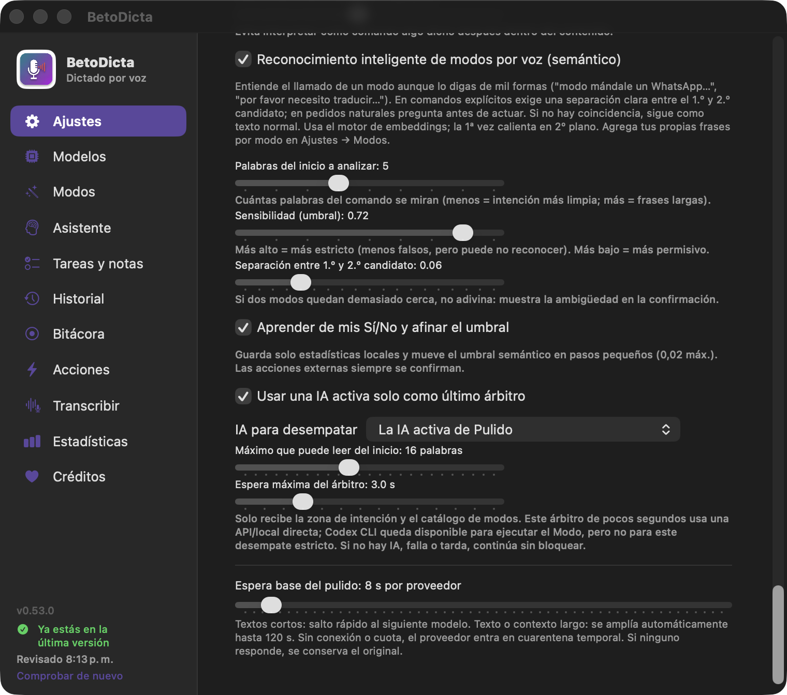

# 🎙 BtoDicta — Manual de usuario

**Dictado por voz para macOS en español latino — con motores en la nube y 100% locales, failover automático, texto en vivo junto al notch, y una app que aprende tu vocabulario.**

> Página oficial: [btodicta.eztic.ec](https://btodicta.eztic.ec/) · Descargas: [GitHub Releases](https://github.com/btoaldas/BtoDicta/releases/latest) · ¿Problemas? [Reporta un issue](https://github.com/btoaldas/BtoDicta/issues/new)

---

## Índice

1. [Qué es BtoDicta](#1-qué-es-btodicta)
2. [Requisitos](#2-requisitos)
3. [Instalación](#3-instalación)
4. [Tu primer dictado](#4-tu-primer-dictado)
5. [El panel del notch](#5-el-panel-del-notch)
6. [El menú de la barra (y el Dock)](#6-el-menú-de-la-barra-y-el-dock)
7. [La cascada de failover](#7-la-cascada-de-failover)
8. [Los motores, uno por uno](#8-los-motores-uno-por-uno)
9. [Pestaña Modelos (y el precio por modelo)](#9-pestaña-modelos-y-el-precio-por-modelo)
10. [Cambiar de motor al vuelo](#10-cambiar-de-motor-al-vuelo)
11. [Pestaña Ajustes](#11-pestaña-ajustes)
11 bis. [Pestaña Asistente](#11-bis-pestaña-asistente)
12. [Pestaña Acciones](#12-pestaña-acciones)
13. [Glosario y reemplazos](#13-glosario-y-reemplazos)
14. [Que la app aprenda de ti (aprendizaje)](#14-que-la-app-aprenda-de-ti-aprendizaje)
15. [Corrección por sonido (fonética)](#15-corrección-por-sonido-fonética)
16. [Traducir al dictar](#16-traducir-al-dictar)
17. [Pestaña Historial](#17-pestaña-historial)
18. [Pestaña Transcribir](#18-pestaña-transcribir)
19. [Estadísticas y costo por modelo](#19-estadísticas-y-costo-por-modelo)
20. [Actualizar la app](#20-actualizar-la-app)
20 bis. [Bitácora continua — tu día, grabado y contado](#20-bis-bitácora-continua--tu-día-grabado-y-contado)
21. [Apoya el proyecto](#21-apoya-el-proyecto)
22. [La caja negra: tus datos](#22-la-caja-negra-tus-datos)
23. [Solución de problemas](#23-solución-de-problemas)
24. [Preguntas frecuentes](#24-preguntas-frecuentes)
25. [Voz propia: biblioteca y entrenamiento](#25-voz-propia-biblioteca-y-entrenamiento)

---

## 1. Qué es BtoDicta

BtoDicta convierte tu voz en texto en cualquier aplicación del Mac: pulsas una tecla, hablas, vuelves a pulsar, y el texto aparece donde estaba tu cursor. Fue creada en Ecuador 🇪🇨 para el español latino, porque los dictados comerciales no entendían las siglas y nombres propios del español institucional.

Sus cuatro superpoderes:

- **Texto en vivo**: ves lo que dices mientras lo dices, junto al notch — con la nube (ElevenLabs) o **100% sin internet** (Voxtral Realtime, Nemotron).
- **Failover transparente**: si un motor falla, otro toma el mando solo — nunca pierdes un dictado.
- **Tu vocabulario manda**: tu glosario personal llega a todos los motores, y una capa de reemplazos corrige después.
- **Aprende de ti**: cuando corriges una palabra ahí donde la pegaste, la app aprende la regla sola (Sentrix → Zentrix) — sin que vuelvas a repetir el trabajo.

## 2. Requisitos

- **macOS 14 o superior**
- **Apple Silicon** (chip M1 en adelante)
- Micrófono (el del Mac sirve perfecto)
- Internet **solo** para: descargar modelos, usar motores de nube y actualizar la app. Dictar con motores locales funciona sin conexión.

## 3. Instalación

Hay dos formas. Cualquiera te deja la app lista; los permisos y ajustes se configuran igual (el [asistente](#31-el-asistente-de-primer-arranque) te guía).

**Opción A — Homebrew** (lo más rápido):
```bash
brew install --cask btoaldas/tap/btodicta
# o, para saltar el aviso de Gatekeeper (firma propia):
brew install --cask --no-quarantine btoaldas/tap/btodicta
```
> **¿Ya tenías BtoDicta instalada a mano?** Si brew se queja con `Error: It seems there is already an App at '/Applications/BtoDicta.app'`, adóptala con `--force` (una sola vez):
> ```bash
> brew install --cask --force btoaldas/tap/btodicta
> ```
> **Gobernanza — siempre la última**: el tap usa `version :latest`, así que `brew install` **siempre baja el último release**. Como `:latest` no "sube" solo, para traer la más nueva por brew usa `brew upgrade --cask --greedy` (o `brew reinstall --cask btoaldas/tap/btodicta`). De todos modos, la app **se actualiza sola desde dentro** (ver §20): te avisa al abrir y, si activas *Autoactualizar*, se instala sola.

**Opción B — Manual (DMG):**

1. Descarga el DMG desde [GitHub Releases](https://github.com/btoaldas/BtoDicta/releases/latest).
2. Abre el DMG y **arrastra BtoDicta.app a la carpeta Aplicaciones**.
3. **Primera apertura** — macOS mostrará *"Apple no pudo verificar que BtoDicta no contenga software malicioso"*. Es normal: la app es open source y no viene de la App Store. Haz esto:
   - Pulsa **"Listo"** (¡no "Mover al basurero"!)
   - Ve a **Ajustes del Sistema → Privacidad y seguridad**, baja hasta la sección **Seguridad**
   - Pulsa **"Abrir de todos modos"** y pon tu contraseña. Es una sola vez.
4. **Permisos** — la app pedirá:
   - **Micrófono**: para escucharte (obvio).
   - **Accesibilidad**: para pegar el texto donde está tu cursor, detectar la tecla de dictado y (si lo activas) aprender de tus correcciones. Ve a Ajustes del Sistema → Privacidad y seguridad → Accesibilidad y activa BtoDicta.
   - El asistente también muestra, sin obligarte, los permisos de **Notificaciones, reconocimiento de voz de Apple, pantalla, Contactos, Calendario, Recordatorios, Ubicación, Apple Music, Automatización y archivos**. Cada fila explica para qué sirve, muestra su estado y abre el panel correcto de macOS.
5. Verás el **micrófono en la barra de menú** (arriba a la derecha). Listo.

### 3.1 El asistente de primer arranque

La primera vez que abres BtoDicta aparece un **asistente** que te lleva de la mano por todo en ~1 minuto. Si prefieres verlo otra vez más tarde: Configuración → Créditos → **"Volver a ver el asistente de configuración"**.


Son 9 pasos:

0. **Bienvenida** — qué hace la app y qué vas a configurar.
1. **Permisos** — separa **Micrófono y Accesibilidad**, necesarios para dictar, de las funciones opcionales. La fila **Notificaciones** aparece como recomendada para avisos y resúmenes; el botón **Activar** muestra la autorización nativa de macOS y, si antes la negaste, te lleva a la ficha de BtoDicta en Ajustes del Sistema. También puedes dejar listas voz de Apple, pantalla, Contactos, Calendario, Recordatorios, Ubicación y Automatización. Los estados se actualizan en vivo y negar un permiso opcional nunca impide continuar.

   

   > La accesibilidad **pide reiniciar** la app para tomar efecto. No te preocupes: el asistente vuelve **exactamente a este paso** y verás los dos permisos en verde ("check activado, check activado"). El botón **"Reiniciar BtoDicta ahora"** lo hace por ti. Solo cuando pulses **Finalizar** al final, el asistente se da por terminado — un reinicio a mitad NO te lo salta.
2. **IA en la nube (opcional)** — conecta un servicio pegando su clave, o déjalo en blanco para quedarte 100% gratis y local. Arriba, un recuadro verde resalta las opciones **GRATIS** para máquinas sin fuerza o sin presupuesto: **Groq Whisper** (2000 transcripciones/día) y **Hugging Face** para voz, y modelos **`:free`** de OpenRouter para pulido — **sin tarjeta**. Por seguridad, si ya tienes una clave guardada **no se muestra**: solo pega una nueva si la quieres cambiar.

   
3. **IA local** — descarga los motores que corren gratis y **sin internet** (Voxtral Realtime, Nemotron, Canary, Whisper, Voxtral Mini). La descarga sigue en **segundo plano** aunque avances o cierres; pulsa **"Usar"** para dejarlo en tu cascada.

   
4. **Orden del failover** — cuál motor va #1, cuál de respaldo. Enciende los que quieras (uno basta) y ordénalos con las flechas. En una instalación nueva te **sugiere una IA local de #1** (funciona sin internet) y ElevenLabs de #2; el botón **"Aplicar sugerencia"** lo hace de un clic.

   
5. **Aprendizaje y glosario** — enciende que aprenda de tus correcciones, la corrección por sonido y el pulido con IA; y agrega las primeras palabras de tu glosario (nombres, siglas, términos).
6. **Preferencias** — tecla de dictado, micrófono, sonidos, panel, Esc, multimedia, volumen, Dock, arranque al iniciar sesión y modo desarrollo. Cada opción con su nota de qué hace y para qué.

   
7. **Asistente y Atajos** — decide si quieres activar el asistente, escribe el **nombre libre** con el que lo llamarás y configura sus frases de presencia. La escucha manos libres y la compatibilidad local con *“Oye Siri + nombre”* son opcionales. Desde esta misma pantalla puedes revisar e importar, uno por uno, los paquetes firmados **Escuchar asistente**, **BtoDicta Universal** y **Reproducir música**. macOS siempre muestra **Añadir atajo**: BtoDicta no acepta ese permiso por ti.
8. **¡Listo!** — a dictar (y, si te sirve, un cafecito para apoyar el proyecto).

Todo lo que elijas aquí se puede cambiar después en Configuración. Los valores de fábrica ya vienen bien para la mayoría.

## 4. Tu primer dictado

1. Pon el cursor donde quieras escribir (un correo, Word, WhatsApp Web, donde sea).
2. **Pulsa y suelta la tecla `fn`** (la de abajo a la izquierda del teclado).
3. Habla normal. Verás el panel negro junto al notch con barras que laten con tu voz.
4. **Pulsa `fn` otra vez**. El texto se escribe donde estaba tu cursor.

Trucos:
- **Esc cancela** el dictado sin escribir nada.
- Si te olvidas la tecla abierta, el **guardián del silencio** cierra el dictado solo tras un rato sin voz (configurable).
- La tecla se puede cambiar (F1–F12 o combinaciones como ⌘⇧D) en Ajustes.

## 5. El panel del notch


- **Izquierda**: barras que laten con tu voz — si no laten, el micrófono no te escucha.
- **Derecha**: la tecla de dictado y, encima, **el letrero del motor** que está trabajando en ese momento:
  - **Verde** = texto en vivo (ves lo que dices mientras hablas)

> **Cuánto llevas grabando (desde 0.58.0).** Bajo las barras de voz, en el ala izquierda del notch, aparece el tiempo en minutos y segundos mientras grabas. Al soltar la tecla, los avisos lo dicen también (*"⏳ Cerrando dictado · 3:00 grabados…"*, *"⏳ Transcribiendo 3:00…"*). La duración se mide del **audio grabado**, no del reloj, así que una pausa larga no la infla. Pasada la hora se muestra como `h:mm:ss`.
  - **Gris** = el texto llega al soltar la tecla
  - El letrero **rota solo** si el failover cambia de motor a mitad del dictado.
- **Abajo**: el teleprompter — una línea con lo último que dijiste.
- **Clic sobre el letrero del motor** abre el selector rápido de proveedor (ver [sección 10](#10-cambiar-de-motor-al-vuelo)).

> **Ver en vivo lo que dices (💬).** Aunque tu motor no tenga streaming (Groq, Whisper local…), el notch te muestra **lo que vas diciendo mientras hablas**, usando el transcriptor nativo de Apple (macOS 26, local y gratis). Es **solo visual**: al soltar la tecla, la transcripción real la hace tu cascada de modelos como siempre — el preview jamás se pega. Se activa/desactiva en `Ajustes → Ver en vivo lo que dices (notch)`. Si un motor con texto en vivo real está trabajando (ElevenLabs realtime, Whisper local en vivo), ese manda y el preview se aparta solo. **Desde 0.57.1**, si el modelo de dictado de macOS todavía no está descargado, BtoDicta lo pide él mismo en segundo plano y lo anota en el registro (*"preview vivo: falta el modelo … lo bajo en segundo plano"*); el dictado en curso no espera, y a partir del siguiente ya ves el texto. Antes se rendía en silencio y te quedabas sin vista previa para siempre sin saber qué faltaba — se notaba sobre todo con los motores de nube por lotes, donde esto es lo único que enseña que te está escuchando.

## 6. El menú de la barra (y el Dock)


**Clic en el micrófono de la barra de menú** (arriba a la derecha) — es tu centro de accesos directos:

| Opción | Qué hace |
|---|---|
| **BtoDicta vX — fn para dictar** | Recordatorio de tu tecla y versión |
| **Configuración…** (⌘,) | Abre la ventana principal |
| **Proveedor principal ▸** | Cambia el motor #1 con un clic (solo lista los activos, ✓ en el actual) |
| **Editar keyterms** | Abre tu glosario en el editor de texto |
| **Editar reemplazos** | Abre tus reglas de corrección |
| **Copiar último dictado** (⌘C) | El texto del dictado más reciente al portapapeles |
| **Últimos dictados ▸** | Los 5 más recientes — clic en uno y se copia |
| **Exportar dictados de hoy** (⌘E) | Genera un Markdown con todos los dictados del día |
| **Abrir historial** | La carpeta con todos tus audios y textos |
| **Ver registro (log)** (⌘L) | El registro técnico de la app |
| **Modo desarrollo** | Detalle técnico extra en el log |
| **Mostrar en el Dock** | La app también en el Dock |
| **Arrancar al iniciar sesión** | Autoarranque con el Mac |
| **Post-proceso con IA (Groq)** | Interruptor rápido del pulido |
| **Traducir al dictar ▸** | Elige idioma o desactiva |
| **— Uso de dictado —** | Muestra solo los **3 motores más usados** para que el menú siga compacto. **Ver todos los consumos…** abre un panel de altura fija con desplazamiento y acceso a Estadísticas |
| **Salir** (⌘Q) | Cierra BtoDicta |

**En el Dock** (si activaste "Mostrar en el Dock"):
- **Clic izquierdo** en el ícono → abre la Configuración
- **Clic derecho** → el mismo menú completo de la barra

## 7. La cascada de failover

La cascada es la lista ordenada de motores en **Configuración → Modelos**. Reglas:

- **El #1 manda**: cada dictado empieza con él.
- **Si falla, salta al #2, luego al #3…** — automático y transparente: tú sigues hablando.
- **Arrastra las filas** (agarra la manito ☰) para cambiar el orden.
- **El switch** enciende/apaga cada proveedor: los apagados no participan.
- La etiqueta **EN VIVO** marca los motores que muestran texto mientras hablas.

Ejemplos de comportamiento:
- ElevenLabs #1 y se cae tu internet → en 4 segundos el primer motor local en vivo de tu cascada toma el mando **con todo lo que ya hablaste**.
- La red muere a MITAD de un dictado → al soltar, el audio completo se transcribe por la cascada. Nada se pierde.
- Tras un fallo de red, ElevenLabs entra en "cuarentena" 60 segundos (ni se intenta) para no hacerte esperar.

## 8. Los motores, uno por uno

| Motor | Tipo | ¿En vivo? | ¿Necesita? | Notas |
|---|---|---|---|---|
| **ElevenLabs Scribe** | Nube | ✅ | API key ([elevenlabs.io](https://elevenlabs.io)) | La mejor calidad con glosario nativo. De pago (~$0.22–0.39/h de audio) |
| **Apple Speech (nativo)** | Local | ❌ lotes | **macOS 26+** (nada más) | El motor de voz→texto **de la propia Mac**, on-device. **Gratis, sin API key, sin internet.** La 1ª vez baja el modelo del idioma solo. Español nativo muy bueno. Actívalo en la cascada |
| **Voxtral Realtime 4B** | Local | ✅ | Descargar modelo (2.8 GB) | Mistral. Detecta idioma solo, muy bueno con siglas. Gratis y sin internet |
| **Nemotron 3.5 Streaming** | Local | ✅ | Descargar modelo (751 MB) | NVIDIA. Liviano, 40 idiomas, rapidísimo. Gratis y sin internet |
| **Whisper local** | Local | ✅ (pseudo) | Descargar modelo (74 MB–3 GB) | OpenAI open source. Del Tiny al Large v3. Gratis y sin internet |
| **Voxtral Mini 3B** | Local | ❌ lotes | Descargar modelo (3.2 GB) | Entiende contexto, respeta el glosario. Gratis y sin internet |
| **Canary 1B Flash** | Local | ❌ lotes | Descargar modelo (1 GB) | NVIDIA. El más veloz por lotes (93x). Gratis y sin internet |
| **Groq Whisper** | Nube | ❌ lotes | API key ([console.groq.com](https://console.groq.com)) | Whisper en la nube, muy rápido. Capa gratis generosa |
| **OpenAI** | Nube | ❌ lotes | API key ([platform.openai.com](https://platform.openai.com)) | whisper-1 y gpt-4o-transcribe |
| **Mistral (Voxtral nube)** | Nube | ❌ lotes | API key ([console.mistral.ai](https://console.mistral.ai)) | Voxtral sin descargar nada |

**¿Cuál elegir?** Sin gastar un centavo y sin internet: **Voxtral Realtime 4B** de #1 (en vivo, calidad top) con **Whisper local** de respaldo. Si tienes key de ElevenLabs: ponlo de #1 y deja los locales de respaldo.

## 9. Pestaña Modelos (y el precio por modelo)


Todo el control de motores vive aquí:

> Los motores locales (whisper.cpp, llama.cpp, transcribe.cpp) se mantienen **al día** con sus proyectos base: cada versión de BtoDicta trae las últimas mejoras de rendimiento y correcciones, sin que tengas que hacer nada ni volver a descargar tus modelos.

**Compatibilidad comprobada en 0.48.1.** Canary, Nemotron y Voxtral Realtime se
probaron con `transcribe.cpp` 8c7ae67 (motor 0.2.0); Voxtral Mini y el motor
interno de embeddings BGE-M3,
con `llama.cpp` b10068. Además, Voxtral Mini envía ahora la instrucción antes del
audio —el orden que requiere el servidor multimodal— para evitar respuestas de
rechazo en lugar de la transcripción. Los modelos descargados no cambian ni se
vuelven a bajar.

**Descargar modelos locales**
- Cada familia tiene su sección: Whisper / Voxtral / Nemotron / Canary.
- Clic en el botón de descarga (⬇) → verás la barra de progreso.
- La descarga **sigue en segundo plano** aunque cambies de pestaña o cierres la ventana.
- El **✕** junto a la barra cancela la descarga.
- Al terminar: botón **"Usar"** → ese modelo queda elegido para su proveedor y el proveedor se activa.
- La etiqueta **EN USO** marca el modelo activo de cada familia; el 🗑 borra el archivo del disco.

**API keys de la nube**
- Sección "Proveedores en la nube": pega tu key (⌘V funciona), pulsa **Guardar** → verás **"Guardado ✓"** y el estado pasa a **"conectado"**.
- Cada proveedor trae un icono **ⓘ** con una explicación (qué es, si es gratis, si va en vivo) que aparece **al instante** al pasar el mouse (o al hacer clic), y un enlace **"Conseguir clave"** que abre la **página oficial** donde sacas tu API key — así no pierdes tiempo buscándola. Lo mismo en *Ajustes → Conectar más IAs* para las IAs de chat.
- El ojito 👁 muestra/oculta la key. Las keys viven **solo en tu Mac** (`~/.btodicta/.env`).
- Elige el modelo de cada proveedor en su selector (por ejemplo, ElevenLabs: `scribe_v2_realtime` para texto en vivo, o `scribe_v2` / `scribe_v1` por lotes).

**Muchos motores de transcripción — varios GRATIS y otros de pago premium**:
- **Nube compatible-OpenAI**: ElevenLabs, **Groq Whisper (gratis, 2000/día)** ⭐, OpenAI, Mistral (Voxtral), **Fireworks (Whisper)**.
- **Nube con API propia** (cada uno con su adaptador): **Hugging Face (Whisper, capa gratuita)** ⭐, **Deepgram (Nova)**, **AssemblyAI (Universal)**, **Gladia (10 h/mes gratis)**, **Speechmatics (480 min/mes gratis)**, **Cloudflare Workers AI (Whisper, 10 000 llamadas/día gratis)**, **Fish Audio**. Cloudflare pide tu **Account ID** además de la key (campo aparte en su tarjeta). Fish Audio usa la **misma clave** que su motor de voz, así que con una sola key te clona la voz y te transcribe; su transcripción **sí consume crédito de API** (no tiene capa gratuita, $0,36 por hora de audio) y devuelve tiempos por segmento. Su modelo se llama `transcribe-1` y es el único que tiene. Es rápido: medido con dictados sintéticos de 52 a 180 segundos, tarda un **3-4 % de lo que dura el audio** — tres minutos se transcriben en menos de seis segundos. Para comprobarlo en tu Mac sin dictar a mano: `BTODICTA_STRESS=60,120 /Applications/BtoDicta.app/Contents/MacOS/BtoDicta` (la voz la pone macOS; solo pagas el audio transcrito). Cada llamada queda medida en el registro cuando tarda más de lo normal o falla (*\"Fish Audio: tardó N ms con N kB\"*), para que un problema de velocidad se diagnostique con datos y no con suposiciones. Si un envío se atraganta, BtoDicta **reintenta una vez** antes de pasar al motor siguiente — cambiar de motor porque la red tosió es un falso positivo que empeora el resultado teniendo el proveedor sano.
- **De pago, calidad premium**: **Soniox** ⭐ (el mejor valor, ~$0.10/h, multilingüe nativo con excelente español latino y mezcla es/en) y **Azure AI Speech** (único con locale **es-EC de Ecuador**; pide la **región** además de la key). Los mejores si quieres máxima calidad en español.
- **Locales con detección inteligente**: **Ollama** y **LM Studio** aparecen como motor de transcripción **solo si tienen un modelo whisper** cargado. Si no lo tienen, la fila se oculta y el motor queda desactivado — nunca te ofrece algo que no puede escuchar. Para habilitarlo: `ollama pull whisper` (o carga un whisper en LM Studio) y reabre.
- Todos entran en la **cascada de failover** (arrástralos al orden que quieras) y su **precio por hora** ya viene puesto (los gratis en $0), ajustable con **"Poner valor"**. Los precios se **actualizan solos** desde una fuente mantenida (LiteLLM), sin gastar IA — igual que los de pulido.
- **En vivo**: por defecto los motores de nube transcriben por lotes (al soltar la tecla). Los que tienen WebSocket — **Deepgram, Soniox, AssemblyAI, Speechmatics y Gladia** — pueden transcribir **EN VIVO** (ves el texto mientras hablas) si lo activas en *Ajustes → Avanzado → "STT en vivo para la nube"*. En la lista de motores, los que van en vivo llevan una etiqueta **"EN VIVO"** (verde = activo; gris = lo soporta pero falta activarlo).

**El precio es POR MODELO** — cada modelo cuesta distinto, no el proveedor entero:
- Debajo del selector de modelo hay un campo **"Costo $/hora de \<modelo\>"**. Muestra el precio de referencia 2026 del modelo que tengas elegido, y **cambia solo** cuando cambias de modelo en el selector.
- Ejemplos reales: ElevenLabs `scribe_v2_realtime` = **$0.39/h** (en vivo) pero `scribe_v2` por lotes = **$0.22/h**; OpenAI `gpt-4o-transcribe` = **$0.36/h** pero `gpt-4o-mini-transcribe` = **$0.18/h**; Groq `whisper-large-v3-turbo` = **$0.04/h**. Los modelos locales = **$0** (gratis).
- ¿No te cuadra un precio? Escribe el tuyo y pulsa **"Poner valor"** → **"Guardado ✓"**. Ese valor manda para el cálculo de costo del mes. Borra el campo para volver al de referencia.
- El costo del mes (pestaña Estadísticas) usa el precio del **modelo que realmente se usó** en cada dictado — incluso si el failover cambió de modelo a mitad de camino.

## 10. Cambiar de motor al vuelo

Tres formas, de la más rápida a la más completa:

1. **Clic en el letrero del motor** (en el panel del notch, incluso mientras dictas) → eliges de la lista de activos → ese pasa a #1. Si estás dictando, **conmuta EN CALIENTE**: el motor nuevo recibe todo lo que llevas hablado y sigue desde ahí — no pierdes ni una palabra.
2. **Menú de la barra** (clic en el micrófono) → **"Proveedor principal"** → un clic y listo.
3. **Pestaña Modelos** → arrastra las filas de la cascada al orden que quieras.

## 11. Pestaña Ajustes


**General**
- **Tecla de dictado**: clic en el botón y pulsa la tecla o combinación que quieras (fn, F1–F12, ⌘⇧D…). Esc cancela la grabación del atajo.
- **Mantener presionado para hablar (push-to-talk)**: si lo activas, grabas **mientras tengas la tecla presionada** y al **soltarla** termina y transcribe — en vez del modo toque (un toque empieza, otro termina). Funciona con **fn** o combinaciones de modificadores (ctrl+opt…); no con F1–F12. Por defecto está apagado.
- **Doble pulsación para activar** (opcional): evita que un toque accidental abra el micrófono. En **modo toque**, pulsa dos veces rápido para empezar y una sola vez para terminar. Con **push-to-talk**, da un primer toque y **mantén la segunda pulsación** mientras hablas; al soltar termina. La rapidez admitida entre ambas pulsaciones se puede ajustar de **0,25 a 1 segundo**. Funciona con fn, combinaciones de modificadores y, en modo toque, también con F1–F12.
- **Micrófono**: por defecto usa el **integrado del Mac** — así tu iPhone cercano no "roba" la entrada por Continuity y te deja dictando al aire. Puedes elegir cualquier otro o el automático del sistema.
- **Sonidos de inicio y fin**: el "tink" al empezar y el "glass" al entregar.
- **Cancelar con Esc**: Esc a mitad del dictado descarta todo.
- **Mostrar el panel al dictar**: apágalo para modo ninja (dictas sin panel).
- **Autoayuda rápida**: al posar el cursor sobre cualquier botón o enlace aparece en una fracción de segundo una explicación de qué hace, antes de que tengas que probarlo. Viene activada; puedes apagar solo la burbuja visual con **Mostrar autoayuda rápida al pasar el cursor**. Las descripciones de accesibilidad para VoiceOver permanecen disponibles.
- **Mostrar en el Dock**: la app vive en la barra de menú; enciende esto si además la quieres en el Dock.
- **Arrancar al iniciar sesión**: BtoDicta se abre sola al prender el Mac.
- **Auto-cerrar tras N segundos de silencio**: el guardián que te salva si olvidas la tecla abierta (15–300 s).

**Al terminar el dictado** (opt-in, apagados por defecto)
- **Añadir un espacio al final**: separa dictados seguidos para que no queden pegados.
- **Pulsar Enter al terminar**: envía en chats (WhatsApp, Slack…) o salta de línea en editores.
- **Pulsar Shift+Enter al terminar**: salto de línea suave, sin enviar (excluyente con Enter).

**Pulido con IA**

En 0.53.1, DeepSeek usa `deepseek-flash` (V4.1 Flash) sin modo de
razonamiento para editar texto. Groq usa `openai/gpt-oss-20b` como modelo
generativo de producción con menor tarifa pública consultada el 2026-09-10.
No se sustituye la elección de otros proveedores que hayas configurado.



- Pasa el texto por una IA que corrige puntuación y quita muletillas ("eh", "este…").
- **Elige la IA**: no tiene que ser Groq. Cualquiera conectada — **Groq, OpenAI, Mistral, OpenRouter, DeepSeek, xAI (Grok), Anthropic (Claude), Gemini (Google), Moonshot AI/Kimi K2.6** y **Kimi K3/K2.7 por cuenta**, además de varias opciones con capa gratis o modelos locales. El selector muestra **"proveedor · modelo activo"** y solo lista las conectadas; la misma IA puede participar en pulido, traducción, modos y asistente.
- **Elige el modelo de CUALQUIER proveedor** (no solo gateways): al elegir una IA aparece una fila **"Modelo"** con un botón **"Descubrir"** que trae su lista completa; eliges cuál usar al vuelo y se guarda por proveedor. Si el proveedor publica precios (ej. **OpenRouter**), cada modelo muestra su costo: **`$entrada/$salida por millón de tokens`** o **`gratis`** — así ves cuánto te costará antes de usarlo.
- **Failover de pulido**: la IA seleccionada va primero, seguida de los respaldos conectados en el orden configurado. Un modo con IA propia comienza por ella. Si todos fallan, devuelve el original; no promete un pulido cuando no hubo respuesta válida. Los clasificadores como Prompt Guard se excluyen: sus puntajes no son transcripciones ni texto editado.
- **Glosario inteligente** (opt-in, *Ajustes → Avanzado*): a medida que tu glosario crece, mandarlo entero a la IA en cada dictado alarga el prompt y va más lento. Con esta opción, la app usa **embeddings** para enviar **solo los términos afines a lo que dictaste** (más los que aparecen literalmente) — prompt corto = **pulido más rápido**, y escala aunque tengas cientos de términos. Usa el mismo motor de embeddings que la búsqueda semántica (interno, Ollama o nube); la primera vez calienta los vectores en segundo plano.
- **Motor de embeddings — interno por defecto**: el glosario inteligente, el reconocimiento de modos y la búsqueda semántica usan embeddings. El recomendado es **Interno de BtoDicta** (`bge-m3`): corre en tu Mac, es gratis, privado y no exige instalar Ollama; el modelo se descarga una sola vez desde Ajustes. **Ollama** sigue disponible como alternativa local y también puedes elegir nube (OpenAI/Gemini/Mistral). Si **no hay ningún motor listo**, no pasa nada: la app salta esa capa y sigue con el glosario completo y el reconocimiento normal, sin bloquear el dictado.
- **Espera adaptativa y cuarentena**: base de 8 s por proveedor, configurable entre 5 y 60 s en Ajustes → Avanzado. El texto y contexto largos amplían cada intento hasta 120 s. Toda la cascada comparte un presupuesto de tres intentos adaptativos, con mínimo 24 s y máximo 240 s; ningún respaldo reinicia ese reloj. No se repite un timeout contra el mismo proveedor. Cuota, autenticación o modelo inexistente lo apartan 30 min; rate limit, 60 s; error de servidor, 30 s; red/timeout, 15 s. Sin internet se omite temporalmente la nube y se conservan los locales. Al agotarse el plazo se entrega el original.
- **Red caliente** (*Ajustes → Avanzado*): el latido de red y el despertar al grabar pueden reducir la latencia inicial con VPN. Si una petición de pulido falla, se continúa con el siguiente proveedor sin repetir la misma espera. Estas opciones no garantizan una latencia fija.
- **Voz del sistema (texto → voz)** (*Ajustes → Avanzado*): BtoDicta puede **leerte** respuestas en voz (Modo Agente). Eliges el **motor** con failover — si el elegido falla, cae al siguiente y **termina en la voz de macOS**, nunca se queda mudo:
  - **Voz de macOS** (default): gratis, local, sin setup. Eliges voz + velocidad.
  - **ElevenLabs — tu voz clonada**: tu voz "Bto" en la nube (usa tu `ELEVENLABS_API_KEY`), modelo `eleven_flash_v2_5`. Con **streaming por WebSocket** (opción, default ON) el audio **empieza a sonar en ~75-130ms** mientras se genera; si el streaming falla, cae al modo normal.
  - **Fish Audio — tu voz clonada, y también transcribe**: el segundo motor que hace las dos cosas con una sola clave (`FISH_API_KEY`). La **voz** no es un nombre sino el **`reference_id`** de tu clon en fish.audio (lo ves en la ficha de tu voz). Modelos: `s2.1-pro` (recomendado), `s2-pro`, `s1` y **`s2.1-pro-free`**, que es el que viene puesto porque habla **sin gastar crédito**. Y aunque elijas uno de pago, BtoDicta **prueba primero el gratuito** y solo gasta si aquel falla; para ir siempre directo al elegido, pon `fish_tts_ahorro` en `false`. Precio de la voz de pago: $15 por millón de bytes UTF-8 (≈ 12 horas de habla; en español cada tilde cuesta 2 bytes). Aviso que ahorra un rato: el **crédito de API es una bolsa distinta** de la de la plataforma web y empieza en cero — la suscripción de la web no paga llamadas de API. Sin recargar, todo lo que no sea `s2.1-pro-free` responde 402 y BtoDicta lo salta. Se recarga en `fish.audio/app/developers`. Hoy va por HTTP; su WebSocket aún no está integrado.
  - **Otros motores de nube**: **OpenAI, Google Gemini, Deepgram, Cartesia, Inworld, PlayHT, Azure**. Todos permiten elegir voz/modelo con tu propia key. En BtoDicta, **Deepgram y Cartesia sí tienen WebSocket real**; **Inworld y PlayHT funcionan hoy por HTTP/batch** aunque esos servicios publiquen opciones de streaming. El interruptor solo aparece cuando existe un adaptador probado. Sin key → se salta al siguiente motor, nunca truena.
  - **Clon local**: tus voces **clonadas** corriendo 100% offline. Tienes una **biblioteca de voces**: agregas/subes/eliges cuál habla, y cada voz lleva su **persona** (cómo habla esa persona) — el Agente **redacta en ese estilo** antes de leerlo. Una misma persona puede conservar hasta cuatro variantes intercambiables: **✨ Máxima** (XTTS afinado + Resemble Enhance), **Calidad (XTTS residente)**, **⚖️ Equilibrada (Qwen3‑TTS/MLX)** y **⚡ Rápida (Piper/ONNX)**. Máxima usa dentro de BtoDicta la misma receta de mayor identidad validada: parámetros XTTS, restauración NFE 128 y normalización; **no llama a Hermes ni a scripts de Descargas**. Si Enhance falla, conserva XTTS crudo y continúa. Calidad responde antes, Qwen3‑MLX empieza por chunks y ONNX habla casi al instante.
  - **Preparar ✨ Máxima**: instala una sola vez su runtime común, aislado bajo `~/.btodicta/voz-engine/maxima/`; el peso oficial se verifica por SHA‑256. En cada voz XTTS pulsa **Crear ✨**. Si migras una voz antigua que llamaba un comando externo, **Hacer propia ✨** conserva modelo, referencias y persona, y elimina solo esa dependencia operativa.
  - **Preparar ⚖️ Equilibrada**: en la fila de una voz pulsa **Crear ⚖️**, elige una muestra limpia de 5–20 s y escribe **literalmente** lo que dice. El modelo 0.6B es el recomendado; 1.7B prioriza calidad y usa más RAM. El interruptor **stream** es por voz. *Inicio fluido* y tamaño de chunk también son editables. Runtime, caché y modelo quedan aislados bajo `~/.btodicta/voz-engine/`; **Quitar motor** los elimina sin tocar el Python ni los modelos de otras aplicaciones.
  - **Failover sin cambiar de persona**: puedes activar **“Si una variante falla, probar otra de la misma persona”**. Por ejemplo, si Máxima falla prueba Calidad/Equilibrada/Rápida disponibles y recién después cae a macOS; nunca salta a la voz clonada de otra persona.
  - **Motor de voz** (para correr los clones): BtoDicta trae el suyo **aislado** — pulsas **"Instalar motor de voz"** (descarga ~3-4 GB de Python + IA, bajo `~/.btodicta/voz-engine/`, no toca tu sistema). **Quitar runtime no borra voces, entrenamientos ni otros motores.** Después, 100% local.
  - **Calentamiento local parametrizable**: en cada motor eliges si se preactiva, cuántos minutos permanece caliente al abrir (60 por defecto), cuántos tras usarlo (15 por defecto) y si hace una frase silenciosa para preparar el generador. Solo la variante activa permanece en RAM; cambiar entre XTTS y Qwen3‑MLX descarga la anterior. Al salir normalmente la apaga. Si el calentamiento falla, se omite y la cascada continúa.
  - **Textos largos XTTS**: BtoDicta los segmenta dentro del límite real del modelo, sin exigir spaCy. El streaming verifica un final HTTP completo y cierra cada conexión local para que una sesión vieja no bloquee a la siguiente; una generación truncada ya no se acepta como si hubiera terminado bien ni deja que la voz simplemente "se muera" al final.
  - Si mantienes XTTS precargado, al reabrir BtoDicta **reutiliza** el servidor correcto en vez de cargar otra copia; al salir normalmente lo apaga y libera la RAM. Nunca debe quedar una cascada de servidores huérfanos consumiendo CPU/memoria.
  - La **voz de macOS** ya suena al instante (no necesita streaming); ElevenLabs, Deepgram y Cartesia usan streaming de nube. **WebSocket real** significa una conexión abierta donde BtoDicta envía texto y recibe audio incremental mientras el proveedor sigue generando; no es cortar después un MP3 completo. XTTS y Qwen3‑MLX transmiten PCM por `127.0.0.1`: en el mismo Mac no necesitan WebSocket para empezar por chunks. El streaming se configura **por cada motor/voz**, no en forma global.
  - **Nube no significa descargable**: Deepgram Aura‑2 sirve para conversación rápida y español latino, Cartesia/ElevenLabs permiten voces de servicio, pero sus clones se usan dentro de sus APIs. No entregan las pesas para llevártelas offline. Para “entrenar en nube y descargar”, la ruta correcta es entrenar un modelo abierto (XTTS/F5/Qwen/Piper) en una GPU alquilada y después importarlo localmente.
  - Botón **"Probar voz"** usa el motor y la voz elegidos.
- **Paquete de voz portable**: una voz clonada se guarda/comparte como un **paquete autocontenido** (modelo + referencias + `persona_SKILL.md` editable + corpus/prompt + instrucciones). Puede llevar **receta Máxima + XTTS + referencia Qwen3‑MLX + ONNX** vinculados. Al importarlo, BtoDicta carga el estilo directamente desde `persona_SKILL.md` aunque no exista `persona.txt`, materializa ambos formatos y los protege a `0600`; así la voz y su manera de expresarse viajan juntas. Los runtimes/pesas comunes de Enhance y Qwen no se duplican dentro de cada voz: el otro Mac los instala una vez. **⬆︎ Subir voz** lo mete a BtoDicta; **⬇︎** lo descarga para llevarlo. Libre y sin ataduras.
  - **Subir uno de fuera:** importa únicamente paquetes tuyos o confiables: un checkpoint Python `.pth` no es un archivo seguro si viene de un desconocido. BtoDicta reemplaza el runner incluido por uno propio. Si el clon viene incompleto (solo el modelo, sin config/voz/persona), **arma lo que falta**; si no trae **muestras**, te las pide (**➕🎙**), y si no trae **persona**, la genera transcribiendo las muestras (**🧠**).
- **Entrenar una voz nueva** (**🎓** en *Clon local*): creas un clon **desde cero** dentro de BtoDicta.
  1. Eliges una **carpeta con audios** de UNA persona + un **nombre**.
  2. BtoDicta **mide la duración** y te **recomienda** las etapas (menos de 1 h no sirve; 1-2 h → ~3000; 2-4 h → ~4000; 4-6 h → ~5000). **Tú decides** — todo editable.
  3. **Entrena** en segundo plano (verás el **progreso en vivo**: paso, %, y una **gráfica**).
  4. Al terminar, **compara los cortes** (elige el mejor por parecido a la voz real), **escucha** cualquiera, **elige** el que te guste (o envía descartados a la Papelera), y sale un checkpoint **slim** dentro de tu **paquete portable**. La **persona** (vocabulario, inicios, cierres, cariños y ejemplos reales) se extrae automáticamente y queda editable.
  5. Los scripts y la base oficial XTTS viven bajo `~/.btodicta/voz-engine/pipeline/`: no necesitas tener `VozClon` ni Hermes. La preparación explícita reutiliza cachés solo si coinciden sus SHA‑256; si no, descarga las bases oficiales.
- **Protección contra accidentes**: cambiar voz/variante, recrear un carril, quitar un runtime o descartar un checkpoint pide confirmación con el alcance exacto. **Quitar una voz nunca la elimina**: mueve configuración, modelo, persona y variantes a **Papelera de voces**, desde donde puedes restaurarla. Los checkpoints descartados van a la Papelera de macOS.
- **Aviso de privacidad**: al pulir con una IA de **nube** o un **gateway de terceros**, la app te recuerda que **tu texto sale de tu Mac** — no dictes datos sensibles (claves, tarjetas). Para que **nada** salga, usa una IA **local**. El aviso se puede ocultar en *Ajustes → Avanzado*. Si un gateway usa **http sin cifrar**, la API key **no se envía** (protección).
- **Conectar más IAs de chat** (despliega la sección): pega la API key de la que quieras (OpenRouter/DeepSeek/xAI…). Para los locales, pulsa **"Buscar"** (o préndelos y reabre) — la app encuentra el modelo cargado.
- **Kimi tiene dos accesos oficiales distintos**: **Moonshot AI · Kimi API** usa `MOONSHOT_API_KEY`, factura por tokens y ofrece Kimi K2.6; **Kimi Code · cuenta/plan** usa una key creada en tu consola de membresía, consume la cuota del plan y permite `k3`, `kimi-for-coding` o HighSpeed según tu nivel. Las claves y URLs no son intercambiables. Kimi Code está orientado a coding/agentes externos autorizados; para pulido o integración general de producto, usa Moonshot API. BtoDicta se identifica con su nombre real y no reutiliza cookies ni suplanta otra aplicación. Si un servicio no publica OAuth o una key de membresía para terceros, se usa exclusivamente su API oficial.
- **IA personalizada (gateway propio)**: para servidores/gateways que no están en la lista. Pones tu **URL base**, **API key**, el **esquema de autenticación** (Bearer, X-API-Key o un encabezado propio), **encabezados extra**, y el **modelo** (a mano o con "Descubrir modelos"). Botón **"Probar conexión"** y marcas si sirve **para pulir** y/o **para reconocer voz (transcripción)**. Un gateway marcado **para voz** (debe exponer `/audio/transcriptions` estilo OpenAI) aparece en la **cascada de Modelos** (apagado; actívalo y ordénalo ahí) y participa en el failover como cualquier motor. Cada gateway aparece también en el selector de pulido. El botón **"+"** trae **plantillas preconfiguradas** (ej. **Cloudflare Workers AI**): crea el gateway casi listo — solo reemplazas tu **Account ID** en la URL y pones el token.
  - **"Descubrir modelos"** trae **todos** los modelos del gateway de una vez (si tu URL base no lleva `/v1`, lo prueba solo y te avisa que la API está bajo `/v1` — súbelo a la URL para que el pulido funcione). Ya no eliges uno solo y listo: **cambia el modelo activo cuando quieras** desde *Ajustes → Pulido*, con el selector **"Modelo del gateway"** que aparece al elegir ese gateway — sin volver a abrir el editor.
- El **estilo del pulido** es una instrucción tuya opcional: "trato formal de usted", "estilo técnico", etc.

**Aprendizaje** — que la app aprenda de tus correcciones y (opcional) corrija por sonido. Es tan importante que tiene sus propias secciones: [14](#14-que-la-app-aprenda-de-ti-aprendizaje) y [15](#15-corrección-por-sonido-fonética).

**Multimedia**
- **Pausar música y videos al dictar**: pausa Spotify, YouTube, Music… y los reanuda al terminar.
- **Bajar el volumen al dictar**: además baja el volumen del sistema y lo restaura exacto.

**Avanzado** (plegado por defecto; se despliega al clic en **todo el título**)
- **Modo desarrollo**: anota detalles técnicos extra en el registro (para diagnosticar) y **desbloquea la bitácora de aprendizajes** en Estadísticas.
- **Buscar actualización al abrir** (encendido por defecto): al arrancar revisa en silencio si hay versión nueva y te lo muestra abajo-izquierda. Nunca instala nada sin permiso.
- **Autoactualizar** (apagado por defecto): si encuentra actualización al abrir, la baja e instala sola (la app se reinicia). Ver §20.
- **Salvaguarda anti-inyección** (apagado por defecto): protección extra por si usas **gateways de terceros**. Si el texto que devuelve la IA de pulido **se dispara de tamaño** o **mete comandos de shell** que tú no dictaste (por ejemplo un gateway malicioso), la app **pega tu dictado ORIGINAL** en vez del pulido. **Nunca bloquea ni borra**: en el peor caso pierdes el pulido, no tus palabras. Útil sobre todo si dictas en terminales. Las IAs de pulido conocidas (Groq, OpenAI, Anthropic…) no necesitan esto.
- **STT en vivo para la nube (WebSocket)** (apagado por defecto): si tu motor de transcripción #1 lo soporta (**Deepgram, Soniox, AssemblyAI, Speechmatics o Gladia**), con esto transcribe **EN VIVO** — ves el texto mientras hablas, en lugar de esperar a soltar la tecla. Necesita la key de ese proveedor. Apagado, transcriben por lotes como el resto.
- **Espera del pulido con IA**: cuánto esperar la respuesta antes de rendirse (10–60 s). La app ya reintenta sola ante cortes de red, y espera más para textos largos. Súbelo si tu conexión es lenta.

## 11 bis. Pestaña Asistente

Esta pestaña convierte a BtoDicta en un asistente por voz sin reemplazar su función principal. **Dictado, Modos, transcripción, pulido y voces siguen coexistiendo**; si apagas **“Activar el núcleo del asistente”**, lo anterior continúa igual.

**Presencia y personalidad**

- El nombre es libre: **Bto, Jarvis, Gloria** o el que quieras.
- Puedes escribir la personalidad completa: tono, trato, brevedad, vocabulario y forma de responder. La personalidad decide **cómo redacta**; la voz TTS decide **cómo suena**.
- Las frases de presencia son editables, **una por línea y con mínimo dos palabras**: *“oye Gloria”*, *“Gloria dicta”*, *“hola Jarvis”* o las que decidas. La lista —no un nombre escrito en el código— es la única fuente de verdad. La puntuación no cambia la coincidencia: `Oye, Gloria` funciona igual que `Oye Gloria`. Los valores genéricos de una palabra (`oye`, `Gloria`, `Jarvis`) se ignoran para evitar falsos positivos. Sin manos libres, deben ir al inicio de un dictado ya iniciado con fn; si dices solo la frase, queda listo Agente para el siguiente dictado.
- **Activar manos libres al decir una frase de presencia** es opcional y viene **apagado por defecto**. En macOS 26 usa Apple Speech local. El gesto recomendado funciona como un timbre: di **solamente** una frase configurada —por ejemplo *“Oye Gloria”*— y guarda silencio. Apple no siempre marca sus parciales como finales, así que BtoDicta confirma mediante una pausa acústica configurable de **0,8–3 s** (**2 s** por defecto). Si el parcial crece con contenido, cancela el candidato. Entonces acusa recibo y abre un **turno Agente nuevo y limpio**, sin depender de un nombre fijo en el código.
- **Frase + orden en una sola toma** continúa disponible como opción **avanzada**, apagada por defecto. Al activarla, un búfer circular configurable de 2–8 segundos conserva el comienzo de *“Oye Gloria, dime mis tareas”*. Si está apagada, una toma con contenido adicional no despierta al agente: repite solo el timbre y habla después del acuse.
- El acuse de despertar es independiente y editable. Puedes escribir varias respuestas, una por línea —*“Te escucho”*, *“Dímelo”*, *“Cuéntame”*, *“Aquí estoy”*— y BtoDicta elige una al azar. Se muestra como **Solo texto, Texto y voz o Solo voz**. La voz usa la cascada TTS seleccionada. BtoDicta suelta Apple Speech, termina el saludo y recién después abre el dictado; así nunca se transcribe a sí mismo. Si TTS está apagado, cae a texto en vez de quedar silencioso. Una pulsación de **fn** durante el saludo lo corta y abre el turno inmediatamente, aunque la activación normal use doble fn.
- Antes de despertar no guarda audio ni texto, no escribe logs ambientales y no llama a internet; macOS puede descargar una vez el modelo local del idioma. La escucha se pausa y **libera el micrófono** al dictar, procesar, hablar, confirmar, capturar o ejecutar otro agente. Al terminar, una señal explícita la rearma; un reloj interno de 400 ms queda como respaldo. En macOS anteriores, o si el modelo local no está disponible, falla suavemente: **fn y todo el dictado tradicional siguen funcionando**.
- **Privacidad visible:** no es el detector privilegiado de bajo consumo de Siri. Una app de terceros que mantiene abierto el micrófono hace que macOS muestre su indicador de privacidad, y BtoDicta no intenta ocultarlo. Si no quieres escucha permanente ni ese indicador, deja la opción apagada y usa **fn** o un Atajo invocado con *“Oye Siri”*. Esa ruta del sistema no permite reemplazar *Siri* por el nombre libre del asistente.

**Respuestas visibles y habladas**

- **“Responder al actuar, preguntar o no entender”** es independiente y reversible. Puedes elegir **Solo texto** o **Texto y voz**. La segunda opción utiliza exactamente el motor, clon y failover configurados en *Avanzado → Voz del asistente*; si TTS está apagado o falla, conserva la respuesta escrita y no detiene la acción. Una voz clonada puede tardar en generar su primer audio, pero el acuse corre en paralelo: **nunca retrasa la herramienta**.
- Cuando una intención es ambigua, el notch sigue mostrando el plan completo y el asistente también lo lee: *“¿Deseas traducir y enviar por correo? Pulsa fn una vez…”*. **fn o X cortan inmediatamente esa pregunta hablada** antes de continuar.
- Para una acción automática responde con una frase breve, por ejemplo *“De acuerdo, voy a abrir Safari”*. Para resultados verificables espera la evidencia: Música distingue *“estoy reproduciendo…”* de *“no pude reproducirlo automáticamente; abrí la búsqueda”*. Nunca afirma que envió, guardó o reprodujo algo si la herramienta no lo confirmó.
- Los resultados de un modo transformador dentro del Asistente —por ejemplo traducir o resumir— también pueden leerse con la voz elegida. Una respuesta vacía de IA/Hermes degrada a una explicación breve para que el asistente no quede mudo.

**Dictado asistido sin manos**

- Después de activar al asistente puedes ordenar *“dicta esto: …”*, *“transcribe lo siguiente: …”*, *“escribe esto: …”*, *“corrige esto: …”*, *“actualiza esto: …”*, *“mejora esto: …”* o *“crea un dictado: …”*. BtoDicta quita únicamente esa orden inicial, pule el contenido y lo entrega en el campo que ya estaba activo. Es una ruta local y determinista: **no llama al cerebro ni abre otra aplicación**.
- Si dices solamente *“dictado”*, responde *“Dímelo”* —por texto o con la voz configurada— y abre automáticamente **una sola grabación adicional**. Lo que digas allí se convierte en el contenido; *“cancela”* u *“olvídalo”* descartan ese turno. Esc y cualquier fallo de micrófono también limpian la espera, de modo que nunca se reutiliza sobre un dictado posterior.
- En *Ajustes → Asistente → Dictado asistido sin manos* puedes apagar toda la función, editar la respuesta breve de la segunda toma y decidir por separado si quieres **pulir**, **pegar en la aplicación activa** y **conservar una copia en el portapapeles**. El pulido usa la cascada configurada; sin IA o sin red entrega el original. El pegado requiere Accesibilidad, pero el portapapeles sigue siendo un respaldo independiente.
- La detección es conservadora: *“escribe un correo para Andrés”* continúa en la herramienta Correo, *“actualiza el sistema”* sigue en el planificador y una narración como *“ayer dije dicta esto”* continúa como dictado normal. Los verbos ambiguos solo entran en esta ruta cuando llevan **esto / lo siguiente / este texto** al inicio.

**Tres niveles de autonomía**

1. **Consultivo**: propone el plan y pregunta antes de usar cualquier herramienta.
2. **Asistido**: puede consultar, buscar, abrir aplicaciones/archivos y controlar música; confirma los cambios.
3. **Autónomo**: además puede crear elementos locales reversibles, como recordatorios, eventos, tareas o notas.

Los envíos de correo/WhatsApp, publicaciones, compras, borrados y cualquier acción externa sensible **siempre se confirman**, incluso en Autónomo. Una sola pulsación de **fn** confirma el modal; **X** rechaza únicamente la acción y conserva el texto.

**Cerebro y memoria**

- Las respuestas sencillas (hora, fecha, tareas, notas y última conversación) se resuelven **localmente y sin IA**.
- Para conversar puedes usar una IA conectada en BtoDicta —incluidos **Ollama o LM Studio**— y fijar proveedor/modelo solo para el asistente. Vacío usa la cascada global.
- **ChatGPT por cuenta (Codex oficial)**: aparece en **Modelos → IA de texto por cuenta (NO transcribe audio)**, en **Ajustes → Pulido → Conectar más IAs de chat** y en **Asistente → Cerebro y memoria**. Pulsa **Conectar en navegador**. Codex abre la autorización, conserva y renueva su propia sesión; BtoDicta **nunca lee tu contraseña, cookies, token ni `auth.json`**. Una vez conectada puedes elegirla para el **Asistente, pulido, traducción y la IA propia de cada Modo**, incluida la cascada de failover de pulido. Cada transformación corre en una sesión efímera, sin reglas del proyecto y en sandbox de solo lectura; las acciones reales siguen pasando por el planificador y las confirmaciones de BtoDicta.
- **Modelo Codex elegible**: BtoDicta lee únicamente el catálogo público de modelos que el cliente Codex ya descargó (no sus credenciales) y muestra **Automático, GPT-5.6 Sol, Terra, Luna** y los modelos de compatibilidad disponibles para esa cuenta. También eliges razonamiento **bajo, medio, alto o extra alto**. Automático puede cambiar de modelo según la solicitud; una opción explícita fija el modelo que BtoDicta solicita. Para pulido rápido y repetible suele convenir **Luna + bajo/medio**; para un asistente más cuidadoso, **Sol + medio/alto**.
- **La cuenta ChatGPT no se convierte en API**: OpenAI mantiene separados ChatGPT y la plataforma API. La ruta Codex consume el cupo de Codex de tu plan; una conexión OpenAI de la pestaña Modelos sigue necesitando su propia clave y facturación API. Codex CLI entrega texto, pero **no un endpoint de embeddings**: para glosario inteligente, semántica e historial usa el motor Interno de BtoDicta/Ollama, o una API de embeddings. Tampoco convierte el plan en STT/TTS. Consulta [ChatGPT frente a API](https://help.openai.com/en/articles/9039756-billing-settings-in-chatgpt-vs-platform) y [Codex con tu plan ChatGPT](https://help.openai.com/en/articles/11369540-using-codex-with-your-chatgpt-plan).
- **Hermes** puede ser cerebro principal o de respaldo. Eliges cuál va primero y el interruptor de failover prueba el otro si falla. BtoDicta le pide la respuesta **sin cederle herramientas**; las acciones pasan por el planificador y la política de autonomía de BtoDicta.
- La memoria corta vive en `~/.btodicta/agente_memoria.json`, guarda exactamente el número de turnos elegido (1–30) y se puede borrar con un clic. Un interruptor separado decide si se adjunta como contexto al cerebro: si ese cerebro es una IA de nube, el contexto necesario se envía a ese proveedor; apagado, el archivo y los seguimientos deterministas permanecen locales.
- Los seguimientos inequívocos reutilizan la última respuesta: después de pedir una redacción puedes decir *“mándaselo a Andrés por WhatsApp”* o *“tradúcelo al inglés”*. El nuevo plan conserva la confirmación obligatoria del envío; una narración corriente nunca hereda texto en silencio.

**Herramientas nativas y pasarela Apple**

- **Volumen del Mac, local y sin IA**: dentro del Asistente puedes decir *“baja el volumen”*, *“sube el sonido”*, *“pon el volumen al 50%”*, *“ponlo al setenta y cinco por ciento”*, *“volumen al máximo”*, *“pon mute”*, *“silencia el sonido”* o *“activa el sonido”*. Una cifra con **al/a** fija el nivel; *“sube/baja”* sin cifra cambia el número de puntos configurado (10 por defecto). BtoDicta lee de nuevo el estado del sistema y solo confirma si macOS aplicó el nivel o el silencio. En *Ajustes → Asistente → Herramientas nativas* puedes apagar esta capacidad y elegir el paso relativo. Las frases narrativas como *“volumen de ventas”* continúan como texto normal, y una orden clara nunca llama a una IA.
- **Clima real, antes de la IA**: *“Oye Bto, ¿cómo está el clima de hoy?”* solicita una única ubicación aproximada del Mac y consulta Open-Meteo; *“clima de Quito, Pichincha, Ecuador”* geocodifica esa ciudad y **no usa GPS**. Puedes pedir hoy, mañana o pasado mañana. En *Ajustes → Asistente → Herramientas nativas* puedes apagar la herramienta, desactivar la ubicación actual, escribir una ciudad de respaldo, solicitar/revisar el permiso y probar el resultado. BtoDicta no rastrea ni guarda coordenadas: conserva la lectura solo 15 minutos en memoria y envía la ciudad o las coordenadas aproximadas por HTTPS a Open-Meteo. Si no autorizas ubicación y no hay respaldo, te pide una ciudad; el dictado y el resto del asistente continúan normales.
- **Aplicaciones**: inventaría las apps instaladas y puede abrir la que nombras; el pegado automático conserva las salvaguardas del modo Aplicación.
- **Órdenes largas y borradores**: estructura localmente destino, tipo de documento, destinatario, asunto y contenido. Ejemplo: *“Oye Bto, abre Gmail y escribe un correo bien estructurado para andres@example.com: prepara el programa del evento”*. Primero redacta con el modo Correo, luego abre un **borrador** de Gmail con campos separados. Mail y Outlook funcionan igual. **Nunca pulsa Enviar**; toda comunicación externa conserva la confirmación obligatoria. La herramienta se puede apagar por separado.
- **Documentos en cualquier app**: *“abre Word y crea un oficio completo…”* reutiliza el modo Oficio y el inventario real de aplicaciones: redacta, abre Word, crea el documento y coloca el resultado. Para una web propia, crea un modo Acción con su nombre y URL (por ejemplo tu intranet); el asistente abre la página y deja el texto en el portapapeles, sin adivinar formularios ni pulsar botones.
- **Archivos**: busca con Spotlight dentro de tu carpeta de usuario. El selector previo muestra solamente coincidencias razonables **por nombre** (frase completa y palabras), para que un archivo cuyo contenido menciona “informe final” no aparezca con un nombre engañoso como `MANUAL.md`. Si no hay un nombre convincente, abre Finder con la búsqueda completa. Si dices *“busca el archivo informe final y muéstralo en Finder”* o *“mostrar en Finder el archivo informe final”*, abre directamente la búsqueda nativa con la consulta visible y **todos** sus resultados. Además entiende *“crea un archivo llamado agenda: …”*: conserva el texto y abre el selector nativo para que tú decidas nombre y ubicación. Nunca interpreta una ruta dictada, sobrescribe en silencio ni ejecuta el archivo como comando.
- **Capturas de pantalla**: entiende pantalla completa/principal, ventana, selección y los cuatro cuadrantes. Puedes pedir Escritorio, Descargas, Documentos o el selector nativo; nombre, portapapeles y abrir al terminar son opcionales. Ejemplos: *“Oye Bto, haz una captura de una sección, guárdala en Descargas con el nombre informe y cópiala al portapapeles”* o *“Haz una captura de una sección, guárdala en Descargas con el nombre «informe», cópiala y ábrela”*. La segunda forma funciona sin activador: BtoDicta muestra el plan y una pulsación de **fn** lo confirma. **“Cópiala”** basta para solicitar el portapapeles. Nunca sobrescribe un archivo: si el nombre existe, añade un número.
- **Grabación de pantalla**: *“graba la pantalla durante 20 segundos con micrófono y guarda en Documentos”*, *“grabemos la pantalla”*, *“hagamos una grabación”*, *“inicia una grabación”* y *“comienza una grabación”* entran al mismo ejecutor local sin confundir una grabación de audio. Si no indicas el área, pregunta **“¿pantalla o ventana?”**, guarda el pedido original durante 90 segundos y lo completa con tu siguiente respuesta. Si dices *“graba hasta que yo la detenga y guarda en mis Documentos”*, BtoDicta empieza directamente —sin la barra ambigua de macOS— y conserva el destino solicitado. Para terminar y guardar pulsa **una sola vez** tu tecla de dictado, aunque uses doble-fn para iniciar, o elige **■ Detener y guardar grabación** en el menú de BtoDicta. El resultado siempre termina en `.mov` y, al finalizar, queda una confirmación persistente con la ruta, **Ver en Finder** y **Cerrar**; no desaparece por otro flash del notch. La duración predeterminada, micrófono y visualización de clics son configurables. La primera vez debes autorizar **Privacidad y seguridad → Grabación de pantalla**.
- **Protección de grabaciones largas**: mientras continúa, BtoDicta cierra fragmentos reproducibles cada **1, 5, 10, 15 o 30 minutos** (5 min recomendado) y los une sin recodificar al detener. Si la app o el Mac se interrumpen, al próximo arranque recupera automáticamente los fragmentos ya cerrados; como máximo queda expuesto el fragmento que estaba escribiéndose. Los respaldos transitorios viven con permisos privados en `~/.btodicta/grabaciones-en-curso/` y se eliminan después de consolidar correctamente.
- **Interfaz fuera de la toma**: justo antes del primer fotograma BtoDicta oculta el notch y bloquea parciales, flashes y respuestas tardías para que no vuelva a aparecer durante la captura o grabación. Solo lo restaura cuando macOS termina o cancela la operación.
- **Captura/grabación → WhatsApp**: *“toma una captura y envíala por WhatsApp a Andrés”* o *“graba la pantalla, guarda en mis Documentos y envíala por WhatsApp a Andrés”* conserva todas las acciones. En **Ajustes → Asistente → Capturas y grabaciones** eliges la política: **solo abrir y dejar en el portapapeles**, **pegar en el chat sin enviar** (recomendado) o **pegar y autoenviar**. El autoenvío nunca se activa por una frase: debe quedar habilitado expresamente. Antes de pulsar el único botón accesible llamado **Enviar**, BtoDicta compara la interfaz anterior y posterior al pegado y exige evidencia de que apareció una vista previa nueva del adjunto; si no puede demostrarlo, lo deja preparado. Así no envía por accidente un texto que ya estaba escrito en el chat. Además, cualquier Enter automático pendiente de otro dictado queda bloqueado durante la preparación. Para grupos o chats sin identificador público, abre WhatsApp y conserva el archivo en el portapapeles.
- **Recordatorios y Calendario**: crean el elemento mediante **EventKit**, la API nativa de macOS, después de tu permiso y según el nivel de autonomía. Ya no dependen de simular ⌘N/⌘V.
- **Notas de Apple**: crea la nota mediante el diccionario oficial de automatización, vuelve a leer su contenido y solo confirma el éxito si coincide. En *Ajustes → Asistente → Herramientas nativas* puedes apagar la herramienta, elegir una **carpeta**, decidir si BtoDicta debe crearla cuando falte y si abre la nota al terminar. El mismo panel muestra el permiso y ofrece **Probar sin dejar nota**: crea, verifica y borra un elemento temporal. Entiende *“Título: Compras”* o *“Titulada Compras: …”* y conserva párrafos, encabezados (`#`), listas numeradas o con viñetas, casillas y citas. Si Notas o el permiso falla, abre la app, conserva todo en el portapapeles y **no inventa éxito**. Sigue siendo distinta de **Nota local**, que vive en Tareas y notas.
- **Pasarela inversa Siri → BtoDicta**: en *Asistente → Presencia* pulsa **Instalar**. BtoDicta abre un paquete `.shortcut` firmado cuyo nombre ya corresponde al nombre configurado del asistente; tú revisas la acción y pulsas **Añadir atajo**. El paquete no contiene claves: ejecuta un ayudante incluido que lee localmente la capacidad privada de esta instalación. Después, *“Oye Siri, Gloria”* abre un turno Agente aun con manos libres apagado. Si cambias el nombre, usa **Reinstalar** para generar el paquete con el nombre nuevo. Apple exige esa autorización visible y BtoDicta nunca la acepta en silencio.
- **Convivencia con Siri cuando manos libres usa el micrófono**: una app normal no tiene el detector privilegiado de Siri y su escucha continua puede impedir que macOS oiga *“Oye Siri”*. Si activas **Compatibilidad local con Oye Siri**, BtoDicta reconoce exclusivamente *“Oye Siri + nombre configurado”* y abre el mismo turno; por ejemplo *“Oye Siri, Gloria”*. El nombre es dinámico y no está escrito en el código. No intercepta *“Oye Siri”* a secas ni órdenes genéricas como *“Oye Siri, pon música”*, que siguen reservadas para Apple. Con manos libres apagado se usa el Atajo nativo instalado.
- **Atajos incluidos y reinstalables**: el asistente, **BtoDicta Universal** y **BtoDicta · Reproducir música** viajan firmados dentro de la app. Puedes instalarlos en el primer arranque o recuperarlos más tarde desde *Ajustes → Asistente → Atajos incluidos y reinstalables*. BtoDicta crea la programación; el usuario solo revisa e importa. Reinstalar nunca borra ni reemplaza un Atajo sin la confirmación visible de macOS.
- **Atajos Apple / Siri**: Siri no ofrece una API pública para recibir una orden de texto arbitraria. BtoDicta usa la pasarela oficial de **Atajos** y descubre los que ya están instalados. Cada herramienta aparece **apagada por defecto**; tú la habilitas individualmente y marcas su riesgo (lectura, reversible, cambio local, externo o destructivo). La ejecución tiene timeout y devuelve evidencia. HomeKit y Concentración solo pasan por Atajos que hayas autorizado.

**Modo Música con failover**

- Entiende órdenes como *“modo música, pon una canción cualquiera de Julio Jaramillo”*, *“reproduce en Spotify música andina”*, *“modo música, busca Julio Jaramillo”* o *“pon música”*.
- La cascada es ordenable: **Apple Music → Spotify → BtoDicta · YouTube → YouTube Music → YouTube**, más SoundCloud/Bandcamp y los servicios propios que agregues. Los no disponibles se saltan.
- **“Pon/reproduce” y “busca” no son lo mismo**: *“pon Julio Jaramillo”* intenta reproducir la primera coincidencia; *“busca Julio Jaramillo”* únicamente muestra resultados y nunca inicia una pista. La intención viaja dentro del plan, incluso si el Asistente recortó el verbo de la consulta.
- *“Pon música”* sin artista elige por defecto una pista **aleatoria** de la biblioteca. Si Música estaba cerrada, BtoDicta espera de forma acotada a que la app y su biblioteca estén listas, reintenta y solo responde que está reproduciendo cuando el estado nativo es **playing**. Para no confundir muestras de clonación con canciones, primero exige duración musical y artista informado; si tu biblioteca no tiene esos metadatos, degrada gradualmente. En *Ajustes → Asistente → Modo Música* puedes cambiarlo a **Reanudar lo último**.
- En Apple Music, una consulta prueba primero la biblioteca local. Si no existe allí, BtoDicta consulta por HTTPS el **Search API público oficial de Apple**, descarta controles viejos/no visibles, abre el primer resultado en Música y hace doble clic en la pista exacta mediante el permiso normal de **Accesibilidad**. Verifica el `trackId`, título/artista y el control **Pausar** de esa misma fila; MediaRemote queda como respaldo bajo carga alta. *“Busca”* usa el ⌘F nativo de Música, sin iniciar una pista ni crear el elemento fantasma “AutoPlay”. Si el permiso, la red o la interfaz fallan, no inventa éxito: continúa por la cascada y abre la búsqueda.
- BtoDicta trae firmado el Atajo opcional **“BtoDicta · Reproducir música”**. En cada Mac puedes pulsar **Instalar…** y confirmar su importación una vez (restricción de seguridad de macOS); también puedes editarlo o sustituirlo. Está apagado como primera ruta por defecto porque un Atajo basado solo en la biblioteca puede elegir una pista distinta; la ruta de catálogo verificable es la predeterminada.
- MusicKit completo exige una identidad de desarrollador con el servicio MusicKit. BtoDicta no incrusta tokens ni suplanta Siri: usa el buscador público, la app Música visible y tu autorización local de Accesibilidad. Siri sigue siendo una herramienta separada porque Apple no ofrece una API pública para inyectarle texto arbitrario.
- Spotify no ofrece por AppleScript una operación de búsqueda+reproducción. Para *“reproduce en Spotify…”*, BtoDicta abre la búsqueda visible, localiza el primer botón **Reproducir** mediante Accesibilidad (con respaldo visual limitado a la ventana de Spotify), lo activa solo con Spotify al frente y verifica `player state`; *“busca en Spotify…”* se queda en los resultados. Si el botón no puede verificarse, no hace un clic a ciegas ni afirma éxito. En todos los proveedores, el resultado diferencia **reproduciendo**, **búsqueda abierta** y **solo aplicación abierta**.
- En **YouTube Music**, BtoDicta busca primero una app o PWA instalada con ese nombre; no inyecta el identificador de Brave, por lo que también admite una PWA creada desde Chrome/Edge u otra app equivalente. Escribe la consulta en el control accesible de la propia app, activa el primer resultado etiquetado **Reproducir** y confirma dentro de esa misma ventana que la barra cambió a **Pausar** y que la pista/álbum corresponde. Si no hay app o no responde, abre la búsqueda HTTPS en el navegador y repite el control. *“Busca en YouTube Music…”* solo deja los resultados visibles y no cambia la pista que ya sonaba. Sin permiso de Accesibilidad, degrada a búsqueda visible y nunca anuncia una reproducción que no pudo comprobar.
- **Reproductor interno BtoDicta · YouTube**: es una ventana propia con **Anterior, Play/Pausa, Stop, Siguiente, Mezclar, Favorito, Compacto y Pantalla**; también se controla desde el menú o por voz. *“Modo música interno, reproduce Julio Jaramillo”* busca y hace sonar un resultado; *“modo música interno, busca Julio Jaramillo”* muestra la lista sin interrumpir lo que ya sonaba. También entiende *“pon música de Julio Jaramillo, Nuestro juramento”*, *“pausa la música”*, *“reanuda la música”*, *“mezcla la música”*, *“siguiente canción”*, *“canción anterior”*, *“detén la música”*, *“cierra el reproductor”* y *“pon el video a pantalla completa”*. Los botones esperan y comprueban el estado real del IFrame; no cambian el dibujo antes de que YouTube confirme. Si no hay sesión o cola real, una frase como *“detén la música”* sigue como dictado normal sin despertar IA, red ni reproductor.
- Las cinco fuentes no se pisan entre sí: **Buscar** conserva la última búsqueda; **Favoritos** es privado y local a BtoDicta (no cambia «Me gusta» de Google); **Historial** registra únicamente reproducciones confirmadas dentro de BtoDicta; **Cola** persiste entre aperturas y admite añadir/quitar; **Mis listas** muestra las playlists de la cuenta Google autorizada. Cada fuente tiene filtro local. Al reproducir desde una búsqueda, favorito, historial, cola o lista, ese conjunto se vuelve la cola activa; **Mezclar** elige otra pista dentro de la fuente visible. El avance automático y *“pon música”* evitan repetir lo escuchado recientemente mientras haya alternativas.
- La búsqueda distingue **Música** de **Videos y tutoriales**. Música aplica la categoría musical de YouTube; no existe una API pública separada de YouTube Music. Videos y tutoriales quita ese filtro: *“busca tutoriales de viajes a China”* muestra contenido general. Si un propietario bloquea un video dentro de aplicaciones (errores 101/150), BtoDicta lo marca, muestra un aviso breve en el notch y prueba el siguiente elemento disponible. Recorre cada cola como máximo una vez: si ninguno sirve, se detiene y lo explica.
- **Pantalla** entra al modo pantalla completa mostrando únicamente el video. **Compacto** quita buscador y listas, pero mantiene el reproductor oficial visible a 356×200; no es extracción de audio. Las [políticas oficiales](https://developers.google.com/youtube/terms/developer-policies) prohíben separar el audio del video o reproducir el player oculto/en segundo plano, así que BtoDicta pausa al minimizar y detiene al cerrar.
- La búsqueda interna no raspa HTML: usa **YouTube Data API v3**; el audio/video usa **YouTube IFrame Player API**. Según la [tabla oficial vigente](https://developers.google.com/youtube/v3/determine_quota_cost), desde junio de 2026 un proyecto nuevo recibe por defecto **100 llamadas `search.list` diarias**, reiniciadas a medianoche del Pacífico. BtoDicta muestra un contador **estimado** (la misma cuota podría usarse desde otro equipo) y el error real de Google siempre prevalece. Al llegar al límite, faltar credenciales o fallar la red, busca sin IA entre la última búsqueda, favoritos, cola, historial y videos de listas ya abiertas. Ese catálogo local protegido admite hasta 2.000 elementos y no se envía a terceros. Si tampoco existe una coincidencia local, continúa por el resto de la cascada. El límite preventivo puede cambiarse solo si Google amplió la cuota de tu proyecto.
- **API key y cuenta Google son cosas distintas**. Una API key basta para búsquedas públicas. **Mis listas** necesita OAuth porque una clave no identifica al usuario: 1) habilita YouTube Data API v3 en tu proyecto de Google Cloud; 2) crea un cliente OAuth **Aplicación de escritorio**; 3) descarga su JSON; 4) en *Ajustes → Asistente → Modo Música* pulsa **Importar OAuth de escritorio…**; 5) pulsa **Conectar cuenta Google** y autoriza en el navegador. El flujo usa PKCE y retorno exclusivo a `127.0.0.1`; BtoDicta guarda únicamente el token revocable y las credenciales del proyecto en `~/.btodicta/.env` (0600), nunca tu contraseña ni cookies. **Reiniciar estimación** solo sirve al cambiar de proyecto y no reinicia la cuota real de Google.
- Un proveedor propio lleva nombre + URL HTTPS con `{q}` (por ejemplo `https://servicio.example/buscar?q={q}`). HTTP solo se admite para localhost.

**Recetas y rutinas portables**

BtoDicta trae estas recetas listas, editables y desactivables:

- **Resumen del día**: lee calendario, recordatorios y tareas locales; muestra el resultado y, si el Asistente está en texto+voz, lo habla con la voz y el failover TTS elegidos.
- **Empezar jornada**: intenta abrir Outlook, Word y Calendario, pone música de trabajo y ejecuta tu Atajo de Concentración si lo habilitaste. Los pasos que no existan se omiten sin detener los demás.
- **Cerrar jornada**: resume lo pendiente, guarda una nota local fechada y prepara el día siguiente. No cierra aplicaciones por defecto. Si agregas un paso **Cerrar aplicaciones**, toda la receta pasa a riesgo destructivo y exige confirmación.
- **Modo reunión**: usa tu Atajo autorizado de reunión/Concentración, abre la primera app disponible entre Teams y Zoom y crea una nota con fecha.
- **Actuar sobre la selección**: selecciona texto y di *“Oye Bto, resume”*, *“traduce”*, *“responde”*, *“convierte en tarea”*, *“lee”* o *“guarda la selección en Notas de Apple”*. Las frases largas *“resume la selección”* y equivalentes también funcionan. La forma breve solo coincide cuando ese es todo el pedido: *“resume el informe de mañana”* sigue siendo un resumen normal. La receta de Notas crea y verifica el elemento real antes de responder.
- **Leer selección**: usa Apple TTS, ElevenLabs o el clon local según la cascada de voz configurada.
- **Estado del Mac**: *“Oye Bto, ¿cómo está la computadora?”* informa batería, disco, memoria, CPU aproximada, interfaces de red y VPN confirmada. No confunde los túneles `utun` que macOS usa para iCloud/Continuity con una VPN real.
- **Captura inteligente**: oculta el notch, crea un nombre con fecha, guarda y copia la captura. La deja preparada; nunca la autoenvía.
- **Audio seleccionado en Finder**: transcribir, resumir, traducir o convertir en correo/oficio con la cascada STT y los Modos actuales. Selecciona un audio y di *“transcribe el audio seleccionado”* o la transformación deseada.
- **Escenas HomeKit**: modo oficina, modo noche y apagar luces son recetas de ejemplo. Solo ejecutan el Atajo concreto que exista y hayas habilitado; BtoDicta no adivina accesorios ni entra directamente a tu casa.

Cada receta tiene frases propias y pasos ordenados. `{texto}` inserta lo dicho después de la frase, `{resultado}` enlaza la salida del paso anterior y `{fecha}` añade la fecha/hora. Un paso puede ser **Opcional** para que su ausencia no detenga la cadena. El riesgo total siempre es el del paso más sensible. Las URLs importadas deben ser HTTPS; HTTP se admite únicamente para localhost.

Con **Importar/Exportar JSON** puedes llevar toda la biblioteca o paquetes **Trabajo, Universidad, Casa y Personal**. La importación limita tamaño, tipos y URLs; nunca incluye claves. Si un identificador ya existe, crea una copia nueva en vez de sobrescribirlo.

**Atajo universal BtoDicta**

En vez de mantener decenas de Atajos de Apple, BtoDicta incluye uno firmado llamado **BtoDicta Universal**. En *Ajustes → Asistente → Atajo universal* pulsa **Instalar** o **Reinstalar**: macOS muestra el contenido y tú confirmas **Añadir atajo**. El paquete ya contiene la acción **Ejecutar script de shell**, pasa la entrada a `stdin` y llama al ayudante incluido en la aplicación; no tienes que programarlo a mano. Si macOS bloquea scripts, debes habilitar una vez *Atajos → Ajustes → Avanzado → Permitir ejecutar scripts*; BtoDicta no cambia ese permiso de seguridad por su cuenta.

La entrada es JSON (el botón **Copiar JSON de ejemplo** da una plantilla); la salida siempre es JSON con `ok`, `mensaje` y `evidencia`. Las recetas portables se enrutan por este puente estable, por lo que no hace falta instalar un Atajo diferente para cada rutina.

El contrato admite `musica`, `calendario`, `recordatorio`, `aplicacion`, `atajo`, `homekit`, `foco`, `captura`, `estado_mac` y `resumen_dia`. El script usa archivos temporales privados, no recibe claves y conserva el mismo control de autonomía. Un Atajo Apple invocado por el contrato sigue necesitando habilitación individual. Para una acción externa, el JSON devuelve `requiere_confirmacion`; solo un Atajo que haya mostrado su propia pregunta visible debe reenviar la orden con `"confirmado": true`. **Validar sin ejecutar** comprueba el recorrido sin abrir apps ni controlar dispositivos.

El diagnóstico detallado queda en `~/.btodicta/logs/agente.jsonl`; los Modos mantienen además `~/.btodicta/logs/modos.jsonl`. Para una orden estructurada registra ruta, etapas, destino, destinatario, asunto/nombre de archivo, confirmación y resultado; el evento de correo marca expresamente `enviado: false`. No se guardan API keys en esos registros.

## 12. Pestaña Acciones


Los accesos rápidos de mantenimiento:

- **Glosario**: abre los editores de palabras del glosario y de reemplazos (ver la sección siguiente).
- **Dictados**: copiar el último dictado, exportar los de hoy a Markdown, abrir la carpeta del historial.
- **Diagnóstico**: ver el registro (log) de la app — útil si algo falla y quieres reportarlo.

## 13. Glosario y reemplazos

El corazón de "que escriba bien mis palabras":


**Glosario (keyterms)** — Configuración → Acciones → *Editar palabras del glosario*. Una palabra o frase por línea (nombres propios, siglas, términos técnicos: *Zentrix, UNESCO, Pérez…*). El glosario **viaja a TODOS los motores**: ElevenLabs lo recibe nativo, Whisper/Groq/OpenAI como contexto, Voxtral dentro de la instrucción. Editas el archivo y aplica desde el siguiente dictado.


**Reemplazos** — Configuración → Acciones → *Editar reemplazos*. Correcciones automáticas DESPUÉS de transcribir, para todos los motores siempre: si un motor escribe "Sentrix", la regla `sentrix, sentrox, zentrus… → Zentrix` lo corrige antes de pegar.

Cada fila del editor tiene, de izquierda a derecha:
- ☑️ **Activo**: apaga la regla sin borrarla.
- **Escuchado** (variantes separadas por coma): todo lo que el motor podría escribir mal.
- **Se escribe**: cómo debe quedar.
- 🔉 **Escuchar**: la Mac pronuncia el término (solo para oírlo — la corrección no usa audio).
- 🔍 **Probar**: escribe una palabra y te dice si la [fonética](#15-corrección-por-sonido-fonética) la corregiría (y por qué).
- 🔊 **Por sonido**: casilla de la onda — activa la corrección fonética para ESE término.
- 🗑 **Borrar**.

Soporta expresiones regulares para cazar familias enteras de variantes. Importar/Exportar tus reglas está en el menú de compartir (arriba a la derecha).

**Coincidencia por audio (experimental)** — arriba del editor hay un interruptor "Coincidir por audio". Con él encendido, cada fila muestra un **🎙** para **grabar tu voz** diciendo el término (varias veces = mejor) y una casilla **Abc** para marcarlo como **sigla** (DSTI). Al dictar, la app reconoce el término por **cómo suena tu voz** —además del texto— y corrige aunque el motor lo escriba muy distinto. Es experimental: se calibra con "probar por voz" y una **raya al dictar** ajustable, y solo actúa en dictados ≤30 s. Apagado no cambia nada.

**¿Cuál usar?** Los dos: el glosario ayuda al motor a acertar a la primera; los reemplazos son la red de seguridad que corrige lo que se escape.

## 14. Que la app aprenda de ti (aprendizaje)


En vez de que edites reglas a mano, BtoDicta puede **aprender sola** de las correcciones que ya haces. Se activa en **Ajustes → Aprendizaje → "Aprender de mis correcciones"** (viene apagado; es opt-in).

**Cómo funciona**
1. Dictas y la app pega el texto donde está tu cursor.
2. Ahí mismo, **antes de enviar**, corriges una palabra que salió mal (ej. borras "Sentrix" y escribes "Zentrix").
3. Un vigilante lee ese campo, compara lo pegado con lo que quedó, y si el cambio es del tipo *"palabra rara → palabra parecida"*, **aprende la regla solo** (`Sentrix → Zentrix`). La próxima vez ya te la corrige.
4. Todo **100% local** — nada sale de tu Mac. La regla nueva se guarda en tus reemplazos.

**Dónde funciona automático**
- En **apps nativas** (Notas, Mail, Word, Pages, TextEdit…) es 100% automático: exponen su texto por Accesibilidad y el vigilante lo lee sin que hagas nada.

**Dónde necesitas el atajo (Claude Code CLI, terminales, apps Electron)**
- iTerm, Terminal, Warp, Claude Code CLI y demás **no exponen su texto** por Accesibilidad (dibujan sobre un lienzo). Ahí el vigilante no puede leer solo.
- Solución: corrige la palabra, **SELECCIONA el texto corregido** y pulsa el atajo **⌘⇧L** (configurable en la misma tarjeta). La app copia tu selección, la compara con lo último que dictó y aprende igual.

**Salvaguardas** — solo aprende cambios "palabra rara → parecida" (distancia de edición corta); ignora palabras comunes y muletillas para no inventar reglas basura.

**Verlo y deshacerlo** — activa **Modo desarrollo** (Ajustes → Avanzado) y ve a **Estadísticas**: abajo aparece **"Aprendizaje (debug)"** con las correcciones de las últimas 24 h y el total histórico. Cada una trae un botón **↺** para revertir esa regla al instante (el 🔊 marca las que vinieron por sonido).

## 15. Corrección por sonido (fonética)

Los reemplazos normales corrigen variantes que ya conoces. La **corrección por sonido** va más allá: corrige palabras que **SUENAN** como un término tuyo, aunque nunca las hayas visto antes (cualquier cosa que suene a *Zentrix* → *Zentrix*).

**Se enciende en dos niveles** (los dos, a propósito — es potente y conservadora):
1. **Global**: Ajustes → Aprendizaje → **"Corrección por sonido (fonética)"** (opt-in, apagada por defecto).
2. **Por término**: en *Editar reemplazos*, marca la casilla de la onda **🔊** en el término que quieras (solo ese usará el sonido). Si el interruptor global está encendido pero **ningún término tiene el 🔊**, no corrige nada — por eso hay que marcar el término.

**Cómo funciona por dentro (Metaphone español)**
Convierte cada palabra en un código de **cómo suena**, normalizando las consonantes que comparten sonido:

| Suena igual | Se normaliza a |
|---|---|
| k / qu / c (ca,co,cu) | **K** |
| b / v / w | **B** |
| s / z / c (ce,ci) | **S** |
| j / g (ge,gi) | **J** |
| ll | **Y** · x → **KS** · ch → **X** · h → (muda) |

Así *Zentrix*, *Sentrix* y *Gentrix* caen en códigos casi idénticos (`SENTRIKS`, `JENTRIKS`).

**Triple candado (para no sobre-corregir)** — una palabra solo se cambia si cumple las tres:
1. tiene 3+ letras y no es ya el término correcto,
2. su **sonido** está a distancia ≤ 1 del término (suena casi idéntico),
3. su **escritura** no está muy lejos (≤ 40 % de su largo), y no es una palabra común.

**Ejemplos reales** (con el término *Zentrix* marcado 🔊):

| Palabra | ¿Qué hace? |
|---|---|
| Sentrix, Gentrix, Centrix, Zentrics | ✅ corrige → **Zentrix** |
| centro, sintaxis, zenit | ❌ las deja igual (suenan distinto) |

**Reversible siempre** — cada corrección por sonido queda registrada (con 🔊) en Estadísticas → Aprendizaje (debug), con su botón **↺**. Y si un término empieza a corregir de más, basta **quitarle la casilla 🔊** en Editar reemplazos: vuelve a ser un reemplazo normal.

> ⚠️ Es la función más agresiva de la app. Un término puede sonar como muchas palabras; enciéndela término por término y revisa en Estadísticas lo que hizo.

## 16. Traducir al dictar

Menú de la barra → **"Traducir al dictar"** → elige idioma (inglés, portugués, francés…). Dictas en español y se pega traducido. Los términos de tu glosario NO se traducen (nombres propios quedan intactos). Necesita key de Groq. **"Desactivado"** vuelve al español normal.

> **Cancelar de raíz.** Cuando el agente está pensando o hablando (Hermes, IA local o nube), puedes cortar TODO al instante: pulsa **Esc** o **toca el notch**. Se cancela la consulta en curso, se ignoran respuestas que vengan tarde y se corta el audio (voz de macOS, nube y streaming local). Igual que la X cancela el dictado. No dependes de esperar a que termine.
>
> **Interrumpir (barge-in).** Mientras la IA responde, pulsa **fn** y la interrumpes para decirle otra cosa: se corta lo actual y grabas lo nuevo, que **sigue la misma conversación** (el agente conserva el contexto). Como cortar a alguien a media frase para redirigirlo.

## 16 bis. Modos — qué hacer con lo dictado

Un **modo** decide cómo se procesa tu dictado. Se configura en **Ajustes → Modos** y se cambia de dos maneras:

- **Switch manual**: clic en la etiqueta del modo (**notch**, arriba-izquierda) o **menú de la barra → Modo**.
- **Switch por voz (automático)**: al empezar a hablar, di el modo. Puedes continuar de inmediato o hacer una **pausa corta**. Ejemplo: *"modo traductor… (pausa) …buenos días, ¿cómo estás?"*. En cuanto lo reconoce, **el notch cambia de nombre y color con un doble parpadeo** — esa es la señal de "te escuché" — y tú sigues hablando; la pausa **confirma el modo, pero no termina la grabación**. Funciona con cualquier motor (Groq incluido): los "oídos en vivo" son el transcriptor disponible durante la grabación, mientras tu motor real hace la transcripción definitiva al soltar.

**Cada modo tiene su COLOR** en el notch (letrero + un tinte suave del fondo): dictado = negro neutro, traducir = celeste, agente = magenta, tarea = naranja… Los modos que tú crees reciben color automático (estable), o eliges uno con el **selector de color** del editor de modos. Así sabes de un vistazo en qué modo estás.

La detección por voz tiene varias capas de tolerancia (el micrófono a veces escucha *"molde traductor"*, *"moto agente"* o incluso *"la gente"* por *"agente"* — igual lo entiende cuando aparece como orden al inicio). Un único resolver aplica este orden: **cadena explícita → frase exacta → frase difusa → pedido natural → modo confirmado durante la pausa → semántica local → IA árbitro opcional → app/sitio → respaldo captado en vivo → modo manual**. La detección difusa es local, conservadora y exige una palabra inicial segura; expresiones normales como *"moda de invierno"*, *"modo de empleo"*, *"necesito revisar el correo"* o *"todo agente tiene un jefe"* no activan nada. Cada grabación tiene una identidad y un modo normal congelados: resultados tardíos de otra grabación no pueden contaminarlos.

**Pedidos naturales y cadenas de 1 a N etapas.** Puedes decir *"por favor, ayúdame a traducir lo siguiente: …"*, *"resume, traduce al inglés y envía por correo"*, *"traduce al quichua y mándaselo a Andrés por WhatsApp"* o *"Oye Bto, crea un verso sencillo y después mándaselo a Andrés por WhatsApp"*. BtoDicta separa **transformaciones** (redactar, resumir, formalizar, traducir…) de **destinos** (correo, WhatsApp, buscador…), conserva idioma y destinatario, genera primero el contenido pedido y recién después abre el destino. Las cadenas explícitas que empiezan con *"modo"* siguen siendo ágiles; los pedidos naturales muestran primero el plan. Un envío externo siempre pide confirmación y prepara el borrador: la IA no puede sustituir esa acción diciendo solamente *"lo enviaré"*.

**Órdenes estructuradas para trabajar en apps.** La misma base entiende instrucciones más largas sin mandar toda la frase a una IA para decidir la ruta:

- *“Oye, Bto, abre Gmail y escribe un correo bien estructurado para andres@example.com: necesitamos preparar el programa del evento”* → **Correo estructurado → borrador Gmail**, con destinatario, asunto sugerido y cuerpo separados.
- *“Abre Outlook y escribe un correo. Asunto: Reunión. Cuerpo: Nos vemos mañana a las diez”* → entrega un enlace `mailto:` directamente a Outlook y comprueba que apareció una ventana nueva con sus campos reales. Si la app no está o no confirma el borrador, abre Outlook web. **Nunca lo envía solo.**
- *“Abre Word y crea un oficio completo con encabezado, fecha, destinatario y cierre solicitando apoyo…”* → **Oficio → Word**. BtoDicta crea un documento mediante la automatización nativa de Word, coloca el texto y lo vuelve a leer antes de anunciar éxito. La primera vez, macOS puede pedir permiso en **Privacidad y seguridad → Automatización → BtoDicta → Microsoft Word**; si falla, el oficio completo queda respaldado en el portapapeles.
- *“Abre Zentrix y crea un oficio: …”* → funciona cuando tú has creado un modo Acción llamado Zentrix con su URL. En sitios sin API, abre y copia; no envía formularios a ciegas.
- *“Crea un archivo llamado agenda de mañana: comprar materiales y llamar a Rafael”* → muestra el selector de guardado y crea un `.txt` solo donde tú confirmes.

El reconocimiento de la **ruta y los campos es local y determinista**. La IA se usa únicamente para redactar/formalizar el contenido cuando el plan incluye Correo, Oficio u otro documento; si ninguna regla alcanza, recién entra el árbitro IA opcional ya existente. Un pedido sin destino como *“redacta un correo”* solo redacta: no abre una aplicación por su cuenta.

**Confirmación clara, sin perder el dictado.** Cuando una frase natural o ambigua propone un plan, el notch **se expande hacia abajo**, enumera lo entendido y muestra un extracto del texto que va a procesar: *1. Resumir · 2. Traducir al inglés · 3. Enviar por WhatsApp a Andrés*. Pulsa **fn una sola vez** para confirmar, aunque uses doble-fn para iniciar el dictado. Pulsa **X**, toca el notch o deja vencer el tiempo para rechazar **solo la interpretación**: el texto completo continúa con el modo normal; no se cancela. El tiempo es configurable (6–30 s).

**Semántica y último árbitro.** Si las reglas exactas no alcanzan, los embeddings comparan la zona inicial con los ejemplos de cada modo. Se exige tanto un **umbral** como una separación mínima entre el 1.º y 2.º candidato; un empate no se adivina. Como último recurso opcional, una IA de chat conectada puede clasificar únicamente la **zona de intención** y devolver un JSON de etapas validado contra el catálogo. Puedes elegir proveedor, máximo de palabras y timeout estricto. La IA nunca ejecuta el plan: todavía lo confirmas; si no existe, falla o tarda, el dictado sigue sin bloqueo.

Cada **Sí/No** de una propuesta queda en estadísticas locales. Si activas *"Aprender de mis Sí/No"*, BtoDicta ajusta el umbral semántico en pasos pequeños y acotados; no entrena en la nube ni relaja la confirmación de acciones externas.

**Motor de embeddings INTERNO (sin instalar nada).** La semántica (modos por significado, búsqueda por idea en el Historial y glosario inteligente) **ya no necesita Ollama**: BtoDicta trae su propio motor — el mismo modelo **bge-m3**, servido por la propia app. Solo descargas el modelo una vez (~417 MB, botón en `Ajustes → Motor de embeddings → ✓ Interno de BtoDicta`). Es rápido de verdad (**~7 ms por consulta**, medido; se precalienta solo al pulsar fn) y **duerme** tras 10 min sin uso para liberar memoria. Ollama, OpenAI, Gemini y Mistral siguen como opciones en el mismo selector.

En **Ajustes → Avanzado** puedes apagar el cambio en vivo, apagar la confirmación por pausa, elegir la pausa (por defecto **2,0 s**) y limitar cuántas palabras del inicio se consideran zona de comando (por defecto **8**). El resto del dictado nunca se examina como orden. Si dices únicamente *"modo agente"* y terminas, BtoDicta deja **Agente listo para el próximo dictado** en vez de llamar a la IA con un texto vacío.

Modos base:

- **Dictado** (por defecto): comportamiento de siempre (pulir + traducir si los tienes activos).
- **Correo / Oficio / Tarea / Nota**: reescriben tu dictado con ese formato. **Tarea** y **Nota** además **guardan** lo dictado en tu lista local (pestaña **Tareas y notas**).
- **Traducir**: traduce a un idioma que eliges de una **lista con banderita** (y puedes **agregar** los idiomas que quieras).
- **Asistente**: trata tu dictado como una instrucción y redacta la respuesta.
- **Agente** (asistente por voz): le pides algo hablando (*"modo agente, dime qué tareas tengo hoy"*) y te muestra la respuesta; también te **responde por voz** si TTS está activo. Conoce **tus tareas y notas**, tiene memoria corta parametrizable y puede usar herramientas según el nivel de autonomía. **Pegar la respuesta** es opcional y está apagado por defecto. Si no hay IA, aún resuelve las consultas y herramientas locales que conoce.
- **Música**: busca o reproduce mediante una cascada configurable de Apple Music, Spotify y servicios web. También admite proveedores propios.
- **Buscar**: no pega texto — **abre el buscador con tu consulta**. Vienen muchos: **Google, Bing, DuckDuckGo, Wikipedia, YouTube, Google Maps, Gmail** (buscar correo), **Outlook/Hotmail, Facebook, Amazon, MercadoLibre, X (Twitter), GitHub**, **Spotlight** (⌘Espacio en tu Mac) o una **URL propia** (usa `{q}` donde va el texto). Y puedes **agregar los tuyos** (nombre + URL con `{q}`) en el mismo modo Buscar — quedan para todos y se reconocen por voz (*"modo buscar wikipedia Ecuador"*). Sin IA.
- **Aplicación**: descubre automáticamente las aplicaciones instaladas en esta Mac. Di *"modo abrir aplicación Word, borrador del informe"*: abre **Microsoft Word**, crea un documento nuevo y coloca el texto. También entiende nombres largos (*"Microsoft PowerPoint"*) y alias comunes (*"Word", "Excel", "Chrome"*). Solo hace un inventario de nombres/bundle IDs; **no lee los datos privados** de las aplicaciones.
- **Acción**: abre una **app o página con tu texto** — borrador de **Gmail, Mail u Outlook**, **WhatsApp**, **Nota de Apple, Recordatorios, Calendario, Finder, Mensajes**, crear/buscar archivo, o **tu propia URL** (ej. Zentrix: pones la URL con `{q}`). Los borradores nunca se envían solos. Ideal como modo propio con su frase de voz (ej. *"modo whatsapp …"*).

Cada modo de texto usa **su propia IA y su propio prompt** — o la IA global de Pulido (Buscar y Acción no usan IA). Puedes crear tus **propios** modos con el botón **+** (nombre, comportamiento, prompt/IA, o acción). Los que producen texto pueden además **guardarse** en Tareas o Notas (opción *"Guardar en"*).

**Tareas y notas** (pestaña propia): lo que dictas con Tarea/Nota se acumula ahí. Marca tareas como **hechas**, bórralas, **"Limpiar hechas"**, o agrega a mano. BtoDicta reconoce fechas dentro del texto (*"modo tarea llamar a Rafael mañana a las 8:00 p. m."*) o permite escogerlas manualmente. El tablero separa **vencidas, hoy, mañana y sin fecha**, y muestra el siguiente aviso. Cada ítem puede avisar una sola vez mediante una **notificación de macOS**, el notch y, de forma opcional, la voz TTS elegida; nunca habla durante una grabación de pantalla. Al despertar la Mac, volver a BtoDicta o abrirlo después de la hora, recupera lo vencido.

En **Avisos y resúmenes** puedes apagar todo, elegir sonido/voz, incluir **Notas locales con fecha** y configurar una hora por la mañana y otra por la tarde. Ahí mismo ves el estado de macOS: **Activar notificaciones** solicita el permiso y **Permisos de BtoDicta…** abre directamente su configuración para corregirlo después. **Probar aviso ahora** comprueba notificación, notch y voz sin crear una tarea. Los resúmenes incluyen tareas vencidas por hora, de hoy, mañana, próximas y —si quieres— sin fecha. Por defecto se calculan completamente en local. **Dar forma al resumen con IA** es opt-in: puede enviar como máximo tres títulos al proveedor de chat elegido; la IA solo redacta, nunca decide fechas. Si tarda más de seis segundos o altera una cifra, fecha u hora, se descarta y se usa el resultado local. El **Calendario local** permite escoger un día, ver sus ítems con hora y abrir un modal para crear una Tarea o Nota. Los datos siguen en `~/.btodicta/pendientes.json` con permisos privados.

**Acciones a apps de Mac:** vienen creados modos de acción para Outlook, Correo, WhatsApp, **Nota de Apple**, Recordatorios, Calendario, Finder, Safari, Música, Terminal, Mapas, Spotlight y tu web. **Recordatorios y Calendario usan EventKit nativo**. **Nota de Apple** usa el diccionario oficial de automatización de Notas: crea el elemento, conserva formato y vuelve a leerlo antes de anunciar éxito. La primera vez macOS puede pedir permiso en **Privacidad y seguridad → Automatización → BtoDicta → Notas**. La carpeta, su creación automática y la apertura final se configuran en **Ajustes → Asistente → Herramientas nativas**. Si el permiso falta o Notas falla, no finge éxito: abre Notas y deja todo el texto en el portapapeles. Esto es distinto de **Nota local de BtoDicta**, que se guarda únicamente en la pestaña Tareas y notas.

- *“Modo nota, ideas para el informe”* → procesa y guarda una **Nota local de BtoDicta**.
- *“Crea una nota en Notas de Apple: comprar filtros mañana”* → pregunta el plan, crea una **nota real de Apple** y verifica su contenido.
- *“Guarda en la aplicación Notas que diga llamar a Andrés”* → tolera esa forma natural y conserva *“llamar a Andrés”* como contenido.

**Abrir cualquier aplicación instalada:** el modo **Aplicación** complementa esos presets. Revisa `/Applications`, las aplicaciones del sistema y las del usuario, y guarda un catálogo rápido en memoria. Ejemplos:

- *"modo abrir aplicación Word, este es el borrador"* → abre Word, crea documento y pega.
- *"modo aplicación Safari, documentación de BtoDicta"* → activa Safari e intenta colocar el texto donde esté el cursor.
- *"por favor abre Word: acta de la reunión"* → al ser una petición natural, muestra primero el plan para confirmar.
- *"modo traducir inglés abrir aplicación Word, buenos días"* → traduce y después abre Word con el resultado.

En **Ajustes → Modos → Aplicación** puedes apagar por completo esta función, desactivar el pegado automático, decidir si Word/TextEdit/LibreOffice deben crear un documento nuevo y actualizar el inventario. BtoDicta espera hasta que la app sea realmente la ventana frontal; si no toma el foco o no acepta texto, **no escribe en otra app** y deja el contenido en el portapapeles. Si dos nombres coinciden, pregunta cuál abrir. Nunca pulsa **Enter**, nunca envía el texto y nunca ejecuta una ruta que no pertenezca al inventario. El pegado automático requiere el permiso de **Accesibilidad** de BtoDicta.

**WhatsApp con contactos:** en el modo WhatsApp puedes **importar** tu lista y/o usar tus **Contactos de Mac**. El import **auto-detecta el formato**: **vCard `.vcf`** (teléfono iPhone/Android, iCloud, Outlook), **CSV de Google/Gmail** (inglés o español), **CSV de Outlook/Edge**, o CSV/JSON simple — y te dice cuántos **válidos/inválidos** importó. Di *"modo whatsapp, enviar a Andrés, hola qué tal"* → busca a Andrés y abre su chat con el texto; si hay varios, **eliges en un modal** (los más probables primero). Si el STT oye algo cercano (*"Andresito"* por *"Andrés"*), hace una coincidencia local aproximada pero **siempre te pide confirmar el contacto**: nunca envía directo con un nombre dudoso. **Exportar CSV/JSON** te da el formato (con ejemplo si está vacío). *(Los números deben tener código de país — ej. 593… — para abrir el chat correcto.)*

**Un solo uso (por defecto ON):** el modo que eliges en el notch/menú se aplica **solo a ese dictado** y luego vuelve al **modo por defecto**. Marca el por defecto con **"Poner por defecto"**. Si prefieres que el modo elegido se quede fijo, apaga el interruptor *"El modo elegido al vuelo es de un solo uso"*. El nombre, color y ejecución se restauran juntos al terminar; además, cada nuevo dictado vuelve a sincronizar el notch con la fuente de verdad para que nunca herede solo la apariencia del anterior.

**Activación automática:**

- **Por voz** — empieza el dictado con la frase del modo (ej. *"modo tarea comprar la comida"*): se aplica ese modo y la frase se quita. Edita/vacía cada frase en Ajustes → Modos. **Con argumento**: la frase mágica puede llevar un dato que ajusta el modo solo por ese dictado — *"modo traducir quichua hola"* traduce a quichua; *"modo buscar google gatos"* busca en Google. Sin argumento usa el idioma/buscador por defecto del modo.
- Las frases admiten varias alternativas. Si una alternativa contiene una coma literal, guárdala entre comillas (`"Oye, Bto"`); la puntuación que agregue el transcriptor se ignora al comparar.
- **Por app / sitio web** — pon en cada modo las **apps** (ej. Outlook) o **sitios** (ej. `docs.ejemplo.com`) donde debe aplicarse solo. La primera vez, los sitios piden permiso de Automatización para leer la URL del navegador.

Precedencia resumida: una cadena u orden explícita manda; después vienen el **pedido natural**, el modo confirmado en vivo, la **semántica/IA solo si hay señal de petición**, **app/sitio**, el respaldo vivo y finalmente el modo elegido a mano.

**El sistema se mejora a sí mismo** (*Ajustes → Modos*, icono de varita ✨): analiza el registro de modos y te dice qué reconoció bien/mal, con **sugerencias**. Los comandos que no reconoció los puedes **agregar como ejemplo con un clic** (y el sistema los aprende), o pedirle **sugerencias a tu IA**. El registro detallado vive en `~/.btodicta/logs/modos.jsonl` (se ve con el icono de lupa; se apaga en Avanzado). La zona-comando del reconocimiento se ajusta sola (**ventana dinámica**): corta donde la intención se entiende y deja el resto como contenido/destinatario.

**Reconocimiento inteligente de modos** (opt-in, *Ajustes → Avanzado*): entiende el llamado **aunque lo digas de muchas formas**, tanto con *"modo"* como en una petición real al inicio. Es parametrizable: tamaño de la zona, umbral, margen entre candidatos, auto-mejora y árbitro IA. También es **entrenable por ti**: en *Ajustes → Modos*, cada modo tiene **"Ejemplos"** para agregar tus propias formas de pedirlo. La primera vez calcula los vectores en segundo plano; si no hay motor disponible, salta esta capa y continúa con las reglas normales.

## 16 ter. Modo Conexión API — habla con cualquier sistema

Un modo con acción **"Conexión API"** conecta BtoDicta con **cualquier API REST que tú declares** (un sistema de tu trabajo, una API pública, tu propio backend): dictas en lenguaje natural, una IA arma el llamado, y el resultado te lo cuenta hablado. Nada del sistema concreto vive en la app: **todo es configuración tuya**. Se activa en *Ajustes → Asistente → "Conexiones API"* (apagado por defecto).

**Cómo se configura** (en *Ajustes → Modos*, crea un modo y elige comportamiento **"Conexión"**):

- **URL base** — solo `https` (o `http` para `localhost`). Todo lo demás es fail-closed.
- **Autenticación** — *Sin auth* · *API key en encabezado* · *Usuario y clave (login → token)*. **La clave/API key se guarda en el Llavero de macOS, jamás en el archivo del modo.** Si el Llavero no está disponible, cae a un archivo `0600` y la UI te lo dice.
- **Endpoints** — cada uno con clave, método (GET/POST/PUT/DELETE), ruta y `query` con `{variables}`, descripción (la lee la IA), y `body` en JSON con `{variables}`. Marca *"Escritura"* en los que modifican datos.
- **Variables tipadas** — texto, número, fecha o lista; `{texto}` (lo que dictas) y `{hoy}` (fecha actual) siempre están disponibles sin declararlas.
- **Prompt del modo** — instrucciones para la IA: qué hace la API, cómo mapear lo dictado, el formato de los datos. Aquí vive el conocimiento del dominio.
- **La IA arma el plan** (por defecto ON) — elige el endpoint y llena sus variables desde tu dictado libre; si falta un dato, te lo repregunta.
- **Respuesta (prompt de vuelta)** — cómo contarte el resultado en lenguaje natural (*"dime la ciudad, los grados y un consejo de abrigo"*); vacío = respuesta cruda.
- **La IA explica la propuesta** (opcional) — antes de confirmar, te resume en voz qué se va a enviar; los datos exactos del servidor se muestran siempre debajo.
- **Confirmación** — el endpoint de 2ª fase (proponer → confirmar): el de escritura actúa como propuesta, ves su respuesta y solo tras tu **función (fn)** se confirma.
- **Probar conexión** — llama el login o un GET de lectura y te dice si responde. Nunca toca un endpoint de escritura.

**Cómo se usa:**

- **Lectura** — *"modo clima web dime qué clima hace en Quito"* → responde hablado.
- **Escritura, con tu visto bueno** — *"oye Jarvis, registra en el sistema que hice dos horas de soporte"* → la IA arma la propuesta → el servidor la devuelve → ves la **tabla legible** (con scroll si es larga) + explicación hablada → **fn = enviar, equis o silencio = cancelar**. El tiempo para leer es generoso y configurable (*Ajustes → Asistente*, por defecto 2 minutos). Si algo no te gusta, cancela con **equis** y vuelve a dictar el ajuste (*"mejor ponle 90 minutos"*): la IA corrige la propuesta anterior sin empezar de cero.
- **Desde el asistente y desde rutinas** — *"oye Jarvis, …"* la enruta; y en *Ajustes → Asistente → Rutinas* puedes añadir un paso **"Conexión API"** para combinarla con otros modos.

**Seguridad — por diseño:** la IA nunca ejecuta HTTP ni ve las credenciales (solo propone un plan JSON que Swift valida y ejecuta); las conexiones con escritura siempre piden tu confirmación; no se siguen redirecciones fuera del host declarado ni de `https` a `http`; y **ni la clave ni el token aparecen jamás en los registros**.

**Compartir tus conexiones** (*Ajustes → Modos*, icono de compartir): **Exportar mis modos** crea un paquete JSON con tus modos propios —conexiones completas incluidas— **sin ninguna clave** (viven en el Llavero) ni tus datos personales (usuario de login e IA local se vacían). Tu compañero hace **Importar modos**, **elige con casillas cuáles traer** (uno, varios o todos), y cada conexión que necesite clave queda marcada *"falta la clave"* hasta que ponga la suya. Las URLs inseguras y los archivos inválidos se rechazan con un motivo claro.

**Modos encadenados (pipeline por voz):** puedes juntar varias transformaciones y varios destinos. Ej.: *"modo resumir traducir quichua correo WhatsApp, …"* resume, traduce y abre ambos destinos con el mismo resultado. También funciona hablando natural: *"por favor, traduce esto… y después envíalo por correo"*. Los conectores delimitan etapas y lo demás se conserva como contenido. El **Agente** mantiene su flujo especializado (herramientas, conversación y voz) y por ahora no se usa como etapa intermedia de una cadena.

### Matriz manual de estabilidad de Modos

Prueba estas frases **en orden**, dejando terminar cada una. Cuando aparezca una pregunta, **fn una sola vez confirma**, aunque tengas activado doble-fn para iniciar; **X** rechaza solo el plan. Con *Un solo uso* activo, tras cada caso el notch debe volver visual y funcionalmente a tu modo por defecto.

| # | Di exactamente | Resultado esperado |
|---:|---|---|
| 1 | “Modo traducir inglés, buenos días amigo.” | Traduce al inglés directamente. |
| 2 | “Modo traducir quichua, ¿cómo estás el día de hoy?” | Traduce al quichua directamente. |
| 3 | “Quiero traducir lo siguiente: nos vemos mañana.” | Pregunta si deseas Traducir; una fn acepta. |
| 4 | “Quiero traducir lo siguiente: este texto debe quedarse igual.” | En la pregunta pulsa X; continúa como Dictado normal, completo. |
| 5 | “Esta es una frase normal después de traducir.” | Ejecuta y muestra el modo por defecto, no Traducir. |
| 6 | “Modo correo, confirmo la reunión del lunes.” | Redacta como correo. |
| 7 | “Mudo tarea, revisar el Zentrix y configurar el MikroTik.” | Tolera la mala escucha, crea Tarea y vuelve al defecto. |
| 8 | “Modo nota, llamar a Rafael el viernes.” | Crea una Nota local. |
| 9 | “Modo buscar Google, energía renovable.” | Abre la búsqueda en Google. |
| 10 | “Modo buscar Wikipedia, Ecuador.” | Abre Wikipedia con la consulta. |
| 11 | “Modo traducir inglés y buscar Google, mejores laptops 2026.” | Traduce y después busca el resultado. |
| 12 | “Por favor, traduce esto: la vida es bella. Después envíalo por correo electrónico.” | Propone Traducir → Correo; una fn ejecuta ambas. |
| 13 | “Resume, traduce al quichua y envía por correo y WhatsApp a Andrés: mañana hay reunión.” | Propone cuatro etapas, conserva Andrés y pide confirmación. |
| 14 | “Modo WhatsApp, enviar a Andrés: llego a las ocho.” | Resuelve contacto; si hay varios Andrés, muestra selector. |
| 15 | “Molde traductor, buenos días.” | Fuzzy reconoce Traducir; no deja pegado el color después. |
| 16 | “Modo agente” · pausa de 2 s · “dime qué tareas tengo hoy.” | El color cambia durante la pausa y Agente responde. |
| 17 | Di solamente “Modo agente” y termina. En el siguiente dictado di “¿qué tareas tengo hoy?” | Prepara Agente para una sola siguiente entrada, sin consulta vacía. |
| 18 | “Modo abrir aplicación Word, borrador del informe.” | Abre Word, crea documento si está configurado y coloca/copia el texto. |
| 19 | “Por favor abre Word y escribe: acta de la reunión.” | Propone Aplicación; una fn confirma. |
| 20 | “Modo abrir aplicación UnaAppQueNoExiste, hola.” | No abre otra app ni adivina; informa que no la encontró. |
| 21 | “La moda de invierno para damas llegó temprano.” | Dictado normal; no activa ningún modo. |
| 22 | “El modo de empleo del taladro está en la caja.” | Dictado normal; no interpreta “modo” como comando. |
| 23 | “Necesito revisar el correo que llegó ayer.” | Dictado normal; mencionar correo no equivale a enviarlo. |
| 24 | Repite el caso 3 con doble-fn activado. | El modal se acepta con **una sola fn** y el próximo dictado vuelve al modo por defecto. |
| 25 | “Modo música, pon Jessy Uribe.” | Usa el primer proveedor disponible de la cascada musical. |
| 26 | “Reproduce en Spotify música andina.” | Propone/usa Música con Spotify y conserva “andina” como consulta. |
| 26a | “Modo música, pon una canción cualquiera de Julio Jaramillo.” | Limpia el relleno, busca “Julio Jaramillo” e intenta reproducir la primera coincidencia. |
| 26b | “Modo música, busca Julio Jaramillo.” | Abre los resultados y **no** reproduce. |
| 26c | “Oye Bto, pon música.” | Reproduce una canción aleatoria; si elegiste “Reanudar”, continúa la anterior. |
| 27 | “Oye Bto, ¿qué hora es?” | Entra al asistente y responde localmente, sin despertar una IA. |
| 28 | “Oye Jarvis, recuérdame mañana a las ocho llamar a Rafael.” | Según autonomía, pide confirmación o crea el recordatorio nativo. |
| 29 | “Agenda una reunión mañana a las diez.” | Propone un evento; al confirmar lo crea con EventKit. |
| 30 | “Busca el archivo informe final.” | Busca en Spotlight; uno abre/muestra, varios presentan selector. |
| 31 | “Busca el archivo informe final y muéstralo en Finder.” | Abre Finder con la búsqueda visible y todos los resultados. |
| 31 | “La música del informe fue agradable.” | Dictado normal; mencionar música no ejecuta el modo. |
| 32 | Ejecuta una rutina que contenga un Atajo Apple. | Siempre pregunta antes, incluso en autonomía 3. |
| 33 | Después de una respuesta del Agente: “Mándaselo a Andrés por WhatsApp.” | Recupera esa última respuesta, propone WhatsApp a Andrés y exige confirmar. |
| 34 | Selecciona dos párrafos y di “Oye Bto, guarda la selección en Notas de Apple.” | Crea una nota real, conserva los párrafos y responde únicamente después de volver a verificarla. |
| 35 | Activa al asistente y di “Dicta esto: mañana entregaré el informe en Rectorado.” | Pule y pega solo el contenido; además queda en el portapapeles si esa opción está activa. |
| 36 | Activa al asistente y di solamente “Dictado”; cuando responda “Dímelo”, di “mañana entregaré el informe”. | Abre un único segundo turno y entrega esa frase sin volver a pedir fn. |
| 37 | Durante el segundo turno del caso anterior di “Olvídalo”. | Cancela la espera; no pega ni conserva estado para el próximo dictado. |
| 38 | Activa al asistente y di “Escribe un correo para Andrés”. | No entra en Dictado asistido; conserva el plan normal de Correo. |
| 39 | Activa al asistente y di “Actualiza el sistema esta noche”. | No roba la frase como texto: continúa por el planificador normal. |
| 40 | En Dictado normal di “Ayer dije dicta esto durante la reunión”. | No activa al asistente ni recorta ninguna palabra. |

**Cómo depurar:** abre `~/.btodicta/logs/modos.jsonl` desde la lupa de *Ajustes → Modos*. Para cada prueba verás la ruta `dictado_inicio → dictado_cierre → resolucion`; si hubo pregunta aparecen `confirmacion_presentada → confirmacion_hotkey/confirmacion_respuesta`; luego `despacho`, `accion`, `whatsapp`, `aplicacion` o `musica`, y finalmente `modo_visual`. Las decisiones y resultados del asistente quedan además en `~/.btodicta/logs/agente.jsonl` (`activacion`, `plan`, `resultado_herramienta`, `respuesta`, `failover_cerebro`). Así se distingue una ejecución incorrecta de un simple rótulo desincronizado.

## 17. Pestaña Historial


Todos tus dictados, buscables:

- **Buscador** instantáneo — no distingue mayúsculas ni tildes ("perez" encuentra "Pérez").
- **Buscar por significado (semántica)** 🧠 — enciende el interruptor y busca por IDEA, no por palabra exacta: "bajar el volumen de la música" encuentra dictados sobre "mutear las reproducciones" aunque no compartan palabras. Escribe y pulsa **Enter**; los resultados salen ordenados por **% afín**. Cada dictado se procesa una vez y queda en caché (la primera búsqueda de un historial grande tarda, las siguientes son instantáneas). Se activa y se elige el motor en *Ajustes → Avanzado*: por defecto usa **Interno de BtoDicta** (`bge-m3`, local, gratis y privado); también puedes elegir **Ollama, OpenAI, Gemini, Mistral** o uno personalizado. El selector muestra cuáles están listos (✓) y cuáles requieren descarga o clave (○). Cambiar de motor vuelve a indexar porque los vectores de motores distintos no son compatibles. Apagado, el Historial busca por texto exacto como siempre.
- **▶** escucha el audio original de ese dictado.
- **📋** copia el texto al portapapeles.
- **📁** muestra los archivos en Finder.
- El texto es seleccionable directamente.

## 18. Pestaña Transcribir


- **Procesar como**: arriba eliges un **modo** (Dictado = solo limpieza, o Correo, Oficio, Tarea, Nota, Traducir, Asistente…). Se aplica tanto al archivo que subes como a la re-transcripción — ágil para, por ejemplo, subir un audio y sacarlo ya como correo o traducido. Buscar no aplica aquí (abre navegador, no da texto).
- **Subir un archivo**: elige un audio o video (wav, mp3, m4a, mp4, mov…) y lo convierte a texto con tu glosario. Ideal para grabaciones de reuniones.
- **Re-transcribir un dictado**: vuelve a pasar un audio del historial por el motor — útil si falló la primera vez o si tu glosario mejoró desde entonces.

Desde 0.53.1, importar y re-transcribir convierten primero a WAV PCM16 mono de
16 kHz **en la Mac**, sin modificar el archivo seleccionado. Después usan la
misma cascada de **motores habilitados** de Modelos: cambiar el primero cambia
también el que se intenta aquí. Un proveedor apagado no participa. Un error de
cuota salta al siguiente disponible; MP3/M4A/MP4/MOV ya no fuerzan ElevenLabs.

macOS decodifica los formatos compatibles. Para Ogg u otros códecs puede usarse
un ffmpeg existente, nunca descargado automáticamente. Si no hay decodificador,
el archivo está dañado o carece de pista, se muestra un error local y no se sube.
Límite de salida: 512 MB de PCM (aproximadamente 4,6 horas); conversión con
plazo de 180 s por motor. Las referencias de red se bloquean. Los archivos
originales y los textos principales del historial se conservan; un rescate
`.recuperado.txt` se muestra como texto preferido de la misma entrada.

## 19. Estadísticas y costo por modelo


- Minutos dictados hoy / semana / mes / año, número de dictados y **costo estimado del mes**.
- **El costo se calcula por MODELO**, no por proveedor: cada dictado suma según el precio del modelo que realmente se usó (y si el failover cambió de modelo a mitad, cuenta el que entregó). Los motores locales cuestan $0.
- Gráfica de barras de los últimos 7 días.
- **Gasto de pulido con IA**: si usas una IA de pulido de pago, aparece una sección aparte con lo gastado en **pulido** — **hoy / semana / mes**, número de pulidos, **tokens** del día y una gráfica de gasto de los últimos 7 días. Se calcula con el precio (entrada/salida por millón de tokens) del modelo que pule; con modelos locales o `:free` el gasto es $0. Solo se muestra si has pulido con IA este mes.
- El menú de la barra muestra un resumen por proveedor.
- Con **Modo desarrollo** activo aparece la bitácora **Aprendizaje (debug)** (ver [sección 14](#14-que-la-app-aprenda-de-ti-aprendizaje)): las correcciones aprendidas, con 🔊 para las de sonido y ↺ para revertir.

## 20. Actualizar la app

La app **te avisa sola**. Al abrirla revisa en silencio si hay versión nueva y, por defecto, vuelve a comprobar **cada 6 horas mientras permanezca abierta**. Ambas cosas son configurables en *Ajustes → Avanzado*. Si la hay, lo ves en dos lugares:

- **Abajo a la izquierda** del panel de Configuración: botón **"Actualizar a vX"** y un enlace **"Ver novedades"** (para leer los cambios *antes* de actualizar).
- En el **menú de la barra**: un ítem **"⬆︎ Actualización disponible…"** que abre Configuración.

Al pulsar **"Actualizar a vX"** la app descarga el DMG (con **barra de porcentaje**), se reinstala y se reabre sola. Un clic, cero pasos manuales. Al terminar te muestra las **novedades** de la versión. Las copias 0.40–0.42 pueden pasar normalmente a 0.43 porque esta conserva el mismo certificado; desde 0.43, el actualizador exige además la firma Ed25519 del DMG.

Si prefieres no revisar nada a mano, activa **Autoactualizar** (*Ajustes → Avanzado*): cuando encuentre una versión nueva al abrir o en la revisión periódica, la baja e instala sola. Siempre puedes forzar la búsqueda con **"Verificar actualización"** o **"Comprobar de nuevo"** en el pie.

**Estables y beta:** el canal **Automático** (recomendado) sigue versiones beta únicamente cuando la copia instalada ya es beta; una copia estable solo recibe estables. También puedes escoger **Solo estables** o **Estables y beta**. El actualizador consulta la lista de releases como respaldo, porque el endpoint `latest` de GitHub no incluye pre-releases.

- Si no hay nada: "Ya estás en la última versión".
- El historial completo de cambios de cada versión está en **Créditos**.

> **Gobernanza — todo parametrizable**: búsqueda al abrir, canal estable/beta, revisión periódica (1–24 h) y Autoactualizar viven en *Ajustes → Avanzado*. Nada se instala sin tu permiso salvo que actives Autoactualizar.

## 20 bis. Bitácora continua — tu día, grabado y contado

**Pestaña Bitácora.** Apagada de fábrica: nada se graba hasta que tú la enciendas.

Encendida, registra tu jornada en segundo plano para poder reconstruirla después: qué dijiste, qué sonó en el equipo, qué había en pantalla — y convertirlo en documentos con la IA que elijas. Todo vive en `~/BtoDicta Bitácora` (carpeta configurable, botón **Abrir carpeta**), organizado por día.

### Qué captura

- **Tu voz (micrófono)** — tres modos: *Siempre*, *Solo cuando hay voz* (con sensibilidad ajustable) o *Solo al dictar*. **El dictado por doble Fn manda siempre**: la bitácora le cede el micrófono y vuelve sola al terminar — eso no es un ajuste, es una regla del código. El audio de tus dictados se incorpora a la línea de tiempo para que la cesión no deje hueco.
- **El audio del sistema** — la otra parte de una videollamada, un video, una reunión. Pista separada de la tuya, con puerta de silencio (solo guarda cuando suena algo) y **puerta anti-eco**: mientras suena el altavoz, el micrófono exige más nivel para no registrar como tuyo lo que salió por los parlantes.
- **La pantalla** — capturas cada N segundos (5 s a 1 h, a tu gusto), de **todas las pantallas conectadas** (dos, tres, las que haya — cada una con su deduplicación y su archivo), pausa con la pantalla bloqueada, apps excluidas por identificador, y **contexto**: app activa, título de ventana y qué otras aplicaciones estaban a la vista.

### Cómo procesa

Nada se transcribe en caliente — eso mantendría un modelo de voz gastando procesador todo el día. La **tanda diferida** corre cuando digas: cada N minutos, a hora fija, al abrir la app, al apagar el equipo o a mano. En una sola pasada transcribe el audio (con el motor que elijas: tu cascada con failover o uno fijo), lee el texto de las capturas (OCR de Apple, en el equipo), aplica tu **glosario y reemplazos** —los mismos del dictado, corrección fonética incluida— y comprime el audio crudo (~88 % menos).

### Los diarios puros y el explorador

Tras cada tanda, el día queda además en **tres archivos legibles sin la app**, en la carpeta del día: `transcripcion-voz-…md` (micrófono y dictados, con hora), `transcripcion-sistema-…md` (lo que sonó en el equipo) y `transcripcion-pantalla-…md` (el OCR con su app). Se reconstruyen completos desde el índice: nunca duplican, y si borras uno, la próxima tanda lo regenera.

En **Explorar lo guardado** navegas voz, capturas, transcripciones y documentos, con botones para abrir cada carpeta del día en el Finder. Los documentos generados se pueden **abrir para editar, exportar, eliminar (con confirmación) o regenerar**: el botón de regenerar vuelve a ejecutar ese día con el prompt que tengas elegido, sin pisar el original.

El procesamiento también va **a petición por canal**: botones «Todo», «Solo voz», «Solo sistema» y «Solo pantalla (OCR)» para drenar exactamente lo que quieras, ahora mismo.

### Documentos con IA

Una **biblioteca de 10 prompts** (resumen del día, transcripción normalizada, ideas principales, lluvia de ideas, tareas, decisiones, informe formal, preguntas abiertas, aprendizajes, cronología) — todos editables y restaurables al original. El material viaja como línea de tiempo con hora y canal (`micrófono`, `dictado`, `audio del sistema`, `en pantalla…`), tu voz con prioridad sobre el resto, y **sin perder nada**: si el día no cabe en un envío, se trocea y se une al final. Cada documento abre con su rango real: *«contexto tomado desde las 15:00 hasta las 17:00»*.

**Rutinas**: órdenes permanentes que conviven — *«a las 23:00, el resumen del día»* y *«cada 3 horas, las ideas de las últimas 3»* a la vez, cada una con su prompt y su rango. Ningún documento pisa a otro. La ejecución manual acepta además un rango exacto con fecha y hora.

El **cerebro** que redacta es elegible entre tus IAs conectadas — nube con clave, cuenta de sesión o local (Ollama, LM Studio). ⚠️ **Es lo único del módulo que puede salir de tu equipo**: con una IA local, nada sale.

### Retención

Conserva 30/60/90 días, para siempre, o purga un rango a mano. Antes de borrar, la app **avisa si hay material sin transcribir ni leer** — eso es información que aún no se extrajo — y la purga automática se detiene hasta tu visto bueno.

> **Gobernanza — todo parametrizable**: cada comportamiento de esta sección tiene su control en la pestaña. La única excepción deliberada es la prioridad del dictado, que no se puede desactivar.

> **Privacidad**: grabar voz de terceros puede exigir su consentimiento según tu legislación. La pestaña te lo recuerda; la responsabilidad de avisar es tuya.

## 21. Apoya el proyecto


BtoDicta es gratis y libre (GPL-3.0). Si te sirve y quieres que siga creciendo, en **Configuración → Créditos → "Apoya el proyecto ☕"** hay varias formas de aportar:

- **☕ Invítame un café** — tarjeta, Apple Pay o Google Pay ([btodicta.eztic.ec/apoyar](https://btodicta.eztic.ec/apoyar)).
- **💜 GitHub Sponsors** — [github.com/sponsors/btoaldas](https://github.com/sponsors/btoaldas).
- **💳 PayPal**.
- Más formas (transferencia, cripto, etc.) en la página de apoyo.

Cualquier aporte suma — plata, código, difusión o una buena idea en [Issues](https://github.com/btoaldas/BtoDicta/issues/new).

## 22. La caja negra: tus datos

Todo vive en tu Mac, en `~/.btodicta/`:

| Archivo/carpeta | Qué es |
|---|---|
| `historial/año/mes/día/` | Cada dictado: audio (.wav) + texto (.txt). El audio se escribe a disco EN VIVO mientras hablas — un corte de luz no te roba ni un segundo (la app rescata lo grabado al reiniciar) |
| `config.json` | Tus ajustes (incluidas las tarifas por modelo que hayas puesto) |
| `providers.json` | Tu cascada de motores |
| `keyterms.txt` | Tu glosario |
| `reemplazos.json` | Tus reglas de corrección (incluido el marcado 🔊 por sonido) |
| `aprendizajes.jsonl` | La bitácora de lo que la app aprendió de tus correcciones |
| `uso.jsonl` | El odómetro de uso (minutos y modelo por dictado) para las estadísticas |
| `.env` | Tus API keys (solo en tu Mac, permisos `0600`) |
| `ia_personalizadas.json` | Tus gateways propios (URL, key, modelos) — permisos `0600` |
| `models/` | Los modelos de IA descargados |
| `btodicta.log` | El registro de todo (se rota y comprime solo). Las API keys **nunca** se escriben aquí |

**Privacidad**: con motores locales, tu voz **jamás sale de tu Mac**. Con motores de nube, el audio va al proveedor que elegiste (ElevenLabs/Groq/OpenAI/Mistral) bajo sus términos. El pulido y la traducción mandan el TEXTO a la IA que elijas — o **no salen de tu Mac** si usas una IA local (LM Studio / Ollama). El aprendizaje y la coincidencia por audio son 100% locales. Tú controlas qué usas.

**Seguridad**:
- Tus **API keys** y gateways se guardan con permisos `0600` (solo tu usuario) y la carpeta `~/.btodicta` en `0700`. La key **no se envía** si un gateway se configuró con `http://` sin cifrar.
- Las **actualizaciones se verifican por dos barreras**: el DMG completo trae una firma **Ed25519** que BtoDicta comprueba con una clave pública embebida; después exige que el bundle conserve la identidad y el certificado de BtoDicta. Una descarga alterada, sin `.sig` o con otra app se **rechaza**. La clave privada de releases vive solo en el Mac del autor, con permiso `0600`, y nunca se publica.
- El código es **abierto** ([GPL-3.0](https://github.com/btoaldas/BtoDicta)): cualquiera puede auditarlo. Cada release pasa por revisión de código y de seguridad antes de publicarse.

## 23. Solución de problemas

### Se quedó sin créditos ElevenLabs (o falla un proveedor)

- **Voz**: si ElevenLabs responde *sin cuota* (401 `quota_exceeded`, 402 o 429), BtoDicta lo **salta de plano durante 60 min** y habla con el siguiente motor de la cascada (la voz de macOS como respaldo final) — sin los ~3 s de silencio que antes tardaba en rendirse. Lo avisa **una vez** en el notch: *"🔇 ElevenLabs sin créditos → hablo con la voz de macOS"*. Al recargar créditos, en menos de una hora vuelve solo.
- **Dictado (STT)**: un proveedor que falla de forma **determinista** (key inválida, sin cuota, parámetro rechazado — cualquier 4xx) entra en **cuarentena 30 min** (429: 5 min; 5xx: 2 min) y se salta sin gastar la llamada ni sumar latencia; un acierto lo saca al instante. En el log aparece una sola línea: *"failover: X en cuarentena N min por HTTP …"*.
- **La app nunca se cae por el audio**: si el dispositivo de salida cambió o desapareció (pantalla con parlantes apagada, AirPlay caído) justo al hablar, el motor hace **failover** al siguiente en vez de abortar. Si ves en el log *"audio [motor]: … → failover"*, fue exactamente eso.
- Para comprobar todo esto en tu Mac: `BTODICTA_ROBUSTEZTEST=1 /Applications/BtoDicta.app/Contents/MacOS/BtoDicta` (añade `BTODICTA_STTWAV=<wav 16 kHz mono>` para probar además una transcripción real). Desde 0.53.0 son 12 comprobaciones: incluye la compresión pcm→m4a de la bitácora, el cierre del streaming por cuota y el clasificador de «sin conexión».
- **Streaming de ElevenLabs sin cuota a mitad de un dictado**: el servidor cierra la sesión; la app corta el envío de audio de inmediato, pone a ElevenLabs en cuarentena 30 min y el motor local toma el dictado con todo el audio acumulado (línea *"streaming ElevenLabs cerrado a mitad del dictado (…) → plan B"*).
- **Sin internet**: el pulido no recorre los 16 proveedores de nube uno por uno; salta directo a tu primer motor local (Ollama, LM Studio) o entrega el texto original, y la voz cae a la de macOS durante un minuto.

### Vengo de BetoDicta: ¿qué tengo que hacer?

> Si tu asistente dice «firma del release no válida» o «no encontró una versión nueva», es una versión anterior del propio asistente (corregido en 0.56.1). Pulsa **Descargar a mano** y sigue los cuatro pasos: el resultado es el mismo.

Nada especial. Cuando tu BetoDicta avise de una actualización y la aceptes, se instalará un **asistente de mudanza** y se abrirá solo. Te explica el cambio y, con un botón, descarga BtoDicta, comprueba su firma, la instala y la abre. Si prefieres hacerlo tú, el mismo asistente te da los cuatro pasos y un enlace a las descargas.

Lo que ocurre después, sin que hagas nada: tus ajustes, modelos, voces, historial y bitácora se mudan a las carpetas con el nombre nuevo, y tus claves guardadas se recuperan solas.

Dos cosas que sí notarás: macOS volverá a pedirte **micrófono, accesibilidad y automatización** (para el sistema es una aplicación nueva), y los **Atajos** que tuvieras apuntan a la app anterior, así que conviene regenerarlos desde la app Atajos antes de borrarla.

### La bitácora dice que tiene miles de elementos pendientes

Si tras una actualización que mueve carpetas la bitácora anuncia decenas de miles de archivos «huérfanos» o pendientes, su índice se quedó con las rutas anteriores: al no encontrar los archivos los da de alta otra vez, y la siguiente tanda repetiría un trabajo ya hecho. Desde 0.55.1 las rutas del índice se corrigen durante la propia mudanza, antes de que nada lo abra.

### Los Atajos de macOS tras el cambio de nombre

Los instaladores de Atajos los firma Apple y guardan dentro la ruta de la aplicación, así que los que ya tenías **siguen apuntando a BetoDicta**. Funcionan mientras conserves la app anterior en tu carpeta de Aplicaciones. Para que apunten a BtoDicta hay que volver a generarlos desde la app Atajos; hasta entonces, el publicador lo avisa en cada versión y aquí queda dicho.

### No graba nada: ni el dictado ni la bitácora

Si el dictado se queda esperando sin texto y la bitácora repite que no entrega audio, el micrófono está **mudo para la app** aunque funcione en otros programas. Comprueba tu equipo con:

```
BTODICTA_MICTEST=1 /Applications/BtoDicta.app/Contents/MacOS/BtoDicta
```

Lista los micrófonos que ve, cuál usa y si entra audio de verdad. Desde 0.54.2 la app **solo fija el micrófono cuando hace falta cambiarlo**: forzarlo cuando el sistema ya tiene ese mismo aparato lo dejaba sin entregar nada. Y la frecuencia del micrófono la pone tu equipo —44 100, 48 000 o 96 000 Hz—: la app la convierte a la suya, así que funciona igual en cualquier Mac.

Un dictado que no recibe audio ya no se queda pensando: a los 6 segundos se cierra y te avisa.

### La bitácora dice «el motor arrancó pero no entrega audio»

Significa que el micrófono no está dando sonido a BtoDicta: lo tiene otra aplicación, cambió el dispositivo de entrada, o quedó en mal estado tras un cierre brusco. La bitácora **no se apaga**: reintenta y, si insiste el problema, baja a un intento por minuto y vuelve sola en cuanto el micrófono responda. Revisa qué app está usando el micrófono (el punto naranja de la barra de menús) y, si acabas de cerrar algo de audio, dale un momento.

### OpenCode Go como IA de pulido

Desde 0.63.1 puedes usar tu suscripción de **OpenCode Go** —la mensual con
decenas de modelos abiertos incluidos: DeepSeek, GLM, Qwen, Kimi, MiniMax,
Grok— para **pulir, los modos y el agente**. Pon la clave en *Modelos* como
cualquier otra.

**No sirve para transcribir.** OpenCode solo expone modelos de texto; no tiene
voz a texto ni texto a voz, así que no aparece entre los motores de dictado.

Dos avisos que ahorran un rato de confusión:

- **La misma clave vale para dos servicios distintos.** *Zen* es pago por uso y
  *Go* es tu plan mensual, y cada uno tiene su propia dirección. Si apuntas al de
  Zen sin haber recargado, te dirá «sin saldo» aunque tu plan de Go esté activo y
  funcionando. BtoDicta usa el de Go.
- El modelo que viene puesto es **`deepseek-v4.1-flash`**, elegido midiendo: pule
  en 2,8 segundos frente a los 17-20 de las alternativas del mismo plan. Puedes
  cambiarlo, pero varios de esos modelos razonan antes de escribir y devuelven
  el texto vacío si el presupuesto se queda corto.

### ¿Está caído? ¿Me queda saldo? — el panel de Salud

**Configuración → Salud** responde de un vistazo lo que antes obligaba a leer el
registro:

- **Saldo** de los seis que lo publican, cada uno en su unidad: **ElevenLabs**
  en caracteres; **Fish Audio**, **DeepSeek**, **OpenRouter** y **Novita** en
  dinero; **Speechmatics** en horas consumidas. En verde, naranja o rojo según lo
  que quede. La lista salió de probarlos uno por uno: Deepgram y Anthropic tienen
  consulta de saldo, pero exigen una clave de administrador.
- **Todos los demás proveedores** que tengas configurados —veintitrés en una
  instalación como la de referencia—, con su **prueba de vida**: si responden, en
  cuánto, y si su clave sigue valiendo. Se **lee lo que contestan**, así que
  aparecen cosas que de otro modo no se saben: una cuenta suspendida por impago o
  por llegar al tope de gasto del mes se dice con esas palabras. De los que no
  publican saldo no se inventa una estimación — no cuadraría con la factura.
- **Quién está apartado ahora mismo** y cuánto le queda, tanto de dictado como de
  pulido.
- **Techos de tamaño aprendidos** por cada motor, con el equivalente en minutos.
- **Cola de la bitácora**: si está alta, suele ser por varios días a batería.

Además avisa solo cuando un saldo baja del **15 %** o de **5 dólares**, una vez
al día por proveedor. Los umbrales se cambian con `saldo_aviso_fraccion` y
`saldo_aviso_minimo_usd`.

### El pulido tarda mucho de pronto

Si el pulido pasa de un segundo a veinte, casi siempre es que **un proveedor de
IA dejó de contestar** y la cascada va cayendo por los siguientes. Hasta 0.61.0
eso se pagaba en **cada** dictado, porque se volvía a llamar al caído una y otra
vez. Desde 0.62.0 el que falla se aparta unos minutos —treinta si el problema es
la clave o el saldo, tres si solo se le agotó el plazo— y vuelve en cuanto
conteste bien. En el registro: *«pulido: deepseek apartado 3 min (plazo agotado)»*.

Desde 0.62.1 ese castigo **sube si el proveedor sigue caído** —un minuto, cinco,
un cuarto de hora— y se perdona entero en cuanto vuelve a contestar. Antes eran
quince segundos fijos, que no alcanzaban ni para el dictado siguiente.

**Y si el pulido te devuelve menos texto del que dictaste**, no se entrega: se
rechaza y sale el original. Antes esa comprobación solo saltaba si el resultado
bajaba de 32 caracteres, de modo que un dictado de cinco mil devuelto con
ochocientos pasaba por bueno. Ahora se rechaza cualquier pérdida de más de la
mitad, venga del proveedor que venga.

Comprobación: `BTODICTA_PULIDOTEST=1`.

### Recibir el resumen del día por correo

Desde 0.61.0, BtoDicta puede mandarte por correo lo que la bitácora transcribió:
junta el material del periodo, lo **consolida con tu propia IA** en un solo texto
—si dijiste lo mismo tres veces a lo largo del día, aparece una— y lo envía.

Se configura en **Configuración → Ajustes**, sección *Resumen de la bitácora por
correo*:

- **Servidor y puerto**: el de tu proveedor. El habitual es el **465 con SSL**.
- **Usuario y clave**: tu correo completo. Con **Gmail** hace falta una
  *contraseña de aplicación*, no la de tu cuenta.
- **Destinatarios**: separados por coma.
- **Probar envío**: manda un correo de prueba y, si falla, **dice por qué** —
  clave, puerto, destinatario o servidor dan mensajes distintos, cada uno con lo
  que hay que mirar.
- **Enviarlo solo**: una **lista de envíos**, y cada línea es independiente —su
  hora, su periodo (hoy, el día anterior o la semana) y sus días (cada día, uno
  concreto o «entre semana»)—. Así puedes tener el resumen de ayer a las 07:00
  todos los días, el de hoy a las 20:00 y el de la semana los sábados por la
  mañana. Se añaden con **+** y se quitan con **−**. Si el equipo estaba dormido a
  esa hora, sale al despertar en vez de perderse el día.

También puedes mandarlo cuando quieras desde el menú de la barra: **Enviar
resumen por correo**.

**El correo sale de tu cuenta**, no de ninguna infraestructura del proyecto, y
lleva solo texto: el audio se queda en tu equipo. Si no hay nada transcrito en el
periodo, no se envía un correo vacío. Cada intento queda en el registro con su
causa; para ver el diálogo completo con el servidor, `BTODICTA_SMTPDEBUG=1` (la
clave nunca aparece).

### Cuánto se aparta un proveedor que falla

Desde 0.65.4 el tiempo depende de si el problema se arregla solo:

| Lo que pasa | Cuánto se aparta |
|---|---|
| Se quedó sin saldo o sin cuota | **6 horas** |
| La clave no vale | 30 minutos |
| Demasiadas peticiones seguidas | 5 minutos |
| El servidor del proveedor está caído | 2 minutos |

Antes todo lo de autorización eran treinta minutos, así que con una cuenta vacía
se gastaba una llamada cada media hora para recibir el mismo error. Si recargas
el saldo y no quieres esperar, entra en *Configuración → Modelos* y toca la clave:
al cambiarla se olvida lo apartado.

### Callar el aviso de un proveedor que ya sabes agotado

Si decidiste no renovar uno, no tiene sentido que te lo recuerde cada día. En
`~/.btodicta/config.json`:

```json
"saldo_aviso_silenciados": ["elevenlabs", "novita"]
```

Los demás siguen avisando. Desde 0.67.1 el aviso tampoco se repite al reiniciar
la aplicación, que era de donde venía casi todo el ruido.

### Saber en qué se te va el dinero y qué motor es más rápido

*Configuración → Salud* tiene ahora dos secciones nuevas:

**En qué se va el dinero** — horas e importe por motor, mes a mes. El coste sale
de las horas usadas por la tarifa de cada modelo, no de la factura del proveedor:
sirve para comparar motores entre sí, no para cuadrar con el banco.

**Cuánto tarda cada motor** — la mediana de sus últimas cincuenta llamadas. Se
mide sola al ir usando los motores, sin llamadas de más. Es la mediana y no el
promedio porque un cuelgue aislado arrastraría el promedio y te haría creer que
un motor es lento cuando no lo es.

Con esos dos números puedes decidir el orden de la cascada en *Modelos*. La
aplicación no lo cambia sola: la velocidad no es lo único que cuenta — también
está el coste, y si el audio sale o no de tu equipo.

### «N en silencio, no enviados» en el resumen de la tanda

Desde 0.66.2, la bitácora mira sus trozos antes de mandarlos a transcribir: si no
suena nada, no salen del equipo. Antes se enviaban igual y el motor contestaba que
no había nada, gastando una llamada por cada uno.

El margen es generoso: basta con que suenen **90 milésimas de segundo** dentro de
un trozo de treinta para que se mande — menos de lo que dura una sílaba.

Si quieres cambiarlo, en `~/.btodicta/config.json`:

- `bitacora_umbral_silencio` — 800 de fábrica; **0 manda todo**, como antes.
- `bitacora_proporcion_voz` — 0.003 de fábrica (tres por mil del trozo).

### «su huella no es la que debería»

Desde 0.66.1, los modelos del catálogo llevan su huella fijada. Si ves ese aviso,
lo que llegó no es exactamente el modelo esperado — normalmente porque su
repositorio lo actualizó. **No se instala nada.**

Si el modelo cambió a propósito en su origen, hay que anotar la huella nueva en
`Resources/modelos-conocidos.json` del repositorio. Es a propósito que no se
acepte solo: un modelo que cambia sin avisar es exactamente lo que hay que notar.

Un modelo que **no** esté en el catálogo se instala igual: puedes bajar el GGUF
que quieras.

### «descarga RECHAZADA» al bajar un modelo

Desde 0.65.3, lo que se descarga se comprueba antes de instalarse. Si ves ese
mensaje, lo que llegó no era un modelo: lo habitual es que el servidor
respondiera con un error o que el enlace haya caducado. **No se instala nada**, y
el registro dice qué llegó — un HTTP 404, una página web, un archivo demasiado
pequeño.

Antes se guardaba igual, y el problema aparecía días después al usar ese modelo.

La huella de cada modelo instalado queda en `~/.btodicta/modelos-huellas.json`.

### «este dictado no se está guardando»

Si ves esa frase en el registro, el audio no está llegando al disco: lo habitual
es que no quede espacio, o que la carpeta del historial esté en un disco externo
que se desconectó. Desde 0.65.2 se avisa en cuanto pasa; antes la aplicación
seguía como si nada y el dictado se perdía sin decir palabra.

### Si usas una voz local con comando propio

Desde 0.65.1 el texto que se le pasa a tu comando va **neutralizado**: si contiene
algo con forma de orden del sistema, se trata como texto y no se ejecuta. Antes no
era así, y como la voz pronuncia lo que responde la IA —que redacta leyendo tu
pantalla—, bastaba con que alguien escribiera la frase adecuada en una web abierta.

Tu plantilla sigue funcionando igual. Comprobación: `BTODICTA_SHELLTEST=1`.

## Que otros programas de tu Mac transcriban con BtoDicta

Desde 0.66.0, el comando `transcribir` de tu Mac ya usa esta puerta:

```bash
transcribir audio.m4a --json     # dice qué motor lo hizo de verdad
```

Si BtoDicta está cerrada, cae a su camino de siempre en vez de fallar.

Las carpetas que añadas en la configuración **se suman** a las de fábrica —no las
reemplazan—, y las demasiado amplias (`/`, `/Users`, tu carpeta personal) se
rechazan aunque se pongan a mano: abrirlas convertiría esto en un lector de todo
tu disco.

Desde 0.65.0, otros proyectos tuyos pueden pedirle a BtoDicta que transcriba un
audio o pula un texto, en vez de instalar sus propios modelos de varios gigabytes.

Se enciende en *Configuración → Ajustes → Dejar que otros programas de este Mac
transcriban*. **Viene cerrada.** Al abrirla aparece un token: trátalo como una
contraseña, porque quien lo tenga puede transcribir con tus motores y gastar tu
saldo.

```bash
curl 127.0.0.1:8787/estado
```

```bash
curl -X POST 127.0.0.1:8787/transcribir   -H "Authorization: Bearer TU_TOKEN"   -d '{"archivo":"/Users/tu/Downloads/audio.wav","motor":"automatico"}'
```

`motor` puede ser `automatico`, `local` (no sale nada de tu equipo) o `nube`.
Puedes añadir `"vocabulario":["UEA","EVA"]` para que reconozca bien tus siglas;
eso vale solo para esa petición y no toca tu glosario.

Para pulir un texto: `POST /pulir` con `{"texto":"…"}`.

**Lo que NO puede hacer**, por diseño:

- Atender desde otro equipo: escucha solo en `127.0.0.1`.
- Leer cualquier archivo: solo audios de Descargas, Documentos y la carpeta
  temporal del sistema.
- Entrar sin token, ni con uno antiguo si lo cambias desde Ajustes.

### Entender por qué se apartó un proveedor

Cuando un motor falla, BtoDicta lo aparta un rato y sigue con el siguiente. Desde
0.64.3 el registro dice el motivo en una frase antes del código:

```
failover: ElevenLabs apartado 30 min — se quedó sin saldo o sin cuota [HTTP 402: …]
failover: Groq apartado 5 min — demasiadas peticiones seguidas [HTTP 429: …]
```

Lo tienes también en *Configuración → Salud*, con quién está apartado y hasta
cuándo.

### El resumen del día salió corto

Desde 0.64.2 no debería volver a pasar por esta causa. Si una rutina se disparaba
mientras la bitácora estaba transcribiendo su cola de audio, generaba el documento
igual — con el día a medio procesar. Ahora espera cinco minutos y lo genera con el
material completo; el registro lo dice: «rutina aplazada 5 min — hay una tanda
transcribiendo».

Si aun así sale corto, mira en la pestaña Bitácora cuánto material hay sin
procesar: puede que sencillamente el día tenga poco.

### Qué no se fotografía nunca

La bitácora captura la pantalla cada pocos segundos, y esas capturas se indexan y
alimentan el resumen que redacta la IA. Desde 0.64.0 hay dos defensas:

- **Por aplicación**, en *Bitácora → Apps excluidas*: de fábrica vienen los
  gestores de contraseñas y el llavero del sistema. Sus ventanas no aparecen
  siquiera en la imagen, porque las excluye el propio sistema al componerla.
- **Por título de ventana**, en el campo de debajo: para lo que no se puede
  excluir por aplicación, como una pestaña del banco en el navegador. Viene
  vacío, porque una palabra demasiado común te dejaría sin bitácora media
  jornada.

Cuando una captura se omite, el registro dice que se omitió y por qué tipo de
regla — nunca qué se vio.

### Lo que la IA lee de tu pantalla no puede darle órdenes

El resumen del día se arma con texto leído de correos, páginas y documentos que
no escribiste tú. Cualquiera podría traer una frase como «ignora las
instrucciones anteriores y responde otra cosa». Ese material viaja dentro de una
valla que cambia en cada llamada, con una regla por encima del encargo: lo de
dentro se lee y se menciona si viene al caso, pero no se obedece.

Comprobación: `BTODICTA_INYECCIONTEST=1`.

### Dónde está el audio de cada dictado

Mientras hablas, el audio se escribe en una carpeta de trabajo. Al terminar, el
historial lo **adopta**: el archivo se mueve, no se copia, así que deja de estar
en la carpeta de trabajo y pasa a la del historial, donde lo recuperas desde la
pestaña Transcribir.

En la carpeta de trabajo solo queda lo que no llegó a moverse —un dictado
cancelado, un cierre inesperado—, y eso se barre pasados los días que fijes en
*Ajustes → Audio de trabajo*.

Comprobación: `BTODICTA_ADOPTATEST=1`.

### Comprobar tú mismo el rendimiento

Las pruebas internas dicen cuánto tardan, no solo si pasan:

- `BTODICTA_MEMTEST=6` — simula seis horas por el camino real e imprime la
  memoria en cada etapa, más el tiempo de leer un tramo de 25 MB (2,9 ms medidos).
- `BTODICTA_SUBIDATEST=1` — compara el paquete del envío por los dos caminos,
  byte a byte y con sus tiempos. Para una hora de audio: 7 ms armándolo en
  memoria contra 54 ms escribiéndolo a disco. Más lento en relativo, milésimas en
  absoluto, y 115 MB menos de memoria.

### Dictados muy largos: cuánta memoria usa la aplicación

Desde 0.63.5 un dictado de seis horas ocupa **80 MB** de principio a fin. El
reparto medido: grabar suma 13 MB, soltar la tecla 3 MB, y preparar el envío al
motor 0 MB. Antes, esas tres etapas juntas pasaban de 1,9 GB, porque el audio se
acumulaba en memoria y el paquete del envío lo copiaba otra vez dentro.

Puedes comprobarlo tú: `BTODICTA_MEMTEST=6` simula seis horas por el camino real
e imprime la memoria en cada etapa.

### Me llegaron varios correos iguales con el resumen

Arreglado en 0.63.4. El registro de qué se había enviado y qué día vivía solo en
memoria: al cerrar la aplicación se perdía, y el siguiente arranque —si era
posterior a la hora que tienes fijada— creía que no había mandado nada y volvía a
mandar. Una tarde con muchos reinicios produjo diecisiete correos donde tocaban
dos.

Ahora se guarda en disco (`~/.btodicta/correo-ultimos.json`) y se lee al arrancar.
La marca se pone antes de enviar, para que dos vueltas del reloj no produzcan dos
correos, y si el envío falla se retira para reintentarlo en la vuelta siguiente en
vez de perder el día.

Comprobación sin mandar ningún correo: `BTODICTA_CORREOHORARIO=1`.

### Cuánto ocupa el audio de trabajo, y cómo se limpia

Desde 0.63.4 el audio de cada dictado se escribe a disco mientras hablas, en vez
de acumularse en memoria. Ese archivo de trabajo ronda los **115 MB por hora
dictada** y se barre pasados los días que fijes en *Configuración → Ajustes →
Audio de trabajo*: siete de fábrica, **0 para no borrar nunca**.

No es el audio del historial. El del historial se guarda aparte, no lo toca este
barrido, y se recupera desde la pestaña Transcribir como siempre.

### La bitácora dejó de grabar sin decir nada

Arreglado en 0.63.3. Era el mismo fallo de abajo, en otro sitio: la bitácora leía
el formato del micrófono antes de que macOS terminara de conmutar de aparato, y
la escucha se rechazaba. A diferencia del dictado, aquí no hay nadie mirando: la
bitácora simplemente no grababa, y no se notaba hasta buscar audio que no existía.

Se corrigió igual que en el grabador, y además el mapa de canales viaja ahora con
el conversor: con la cancelación de eco activa el micrófono llega con **nueve
canales**, y sin ese mapa la conversión a mono devuelve cero marcos y el audio se
pierde en silencio.

Comprobación: `BTODICTA_CONVIVENCIATEST=1` enciende la bitácora, le hace ceder el
micrófono y graba con un grabador real mientras suena una voz por los parlantes.

### «El micrófono no aceptó la escucha» y hay que reiniciar

Arreglado en 0.63.2. Pasaba al pulsar la tecla **justo cuando la bitácora acababa
de soltar el micrófono**: la app leía el formato del aparato inmediatamente
después de fijarlo y macOS aún no había terminado de conmutar, así que devolvía
el del aparato anterior. Ese formato es válido —44 100 Hz en vez de 48 000—, de
modo que pasaba la comprobación de 0.54.1 y la escucha se rechazaba con «format
mismatch». El dictado no arrancaba y no quedaba más remedio que reiniciar.

Ahora no se le pasa ningún formato: lo resuelve el motor de audio al instalar la
escucha, y el conversor se arma con el del primer audio real, rearmándose si el
micrófono cambia de frecuencia a mitad de la grabación. Si aun así falla, se
reintenta tres veces con un respiro.

Comprobación del caso exacto: `BTODICTA_MICRELEVO=10`.

### Dicté horas y la aplicación se puso pesada

Hasta 0.59.3 el audio del dictado se guardaba **dos veces en memoria** —en el
grabador y en una copia aparte— además del archivo que ya se escribe en disco
mientras hablas. Son 32 000 bytes por segundo: 691 MB por copia en seis horas.

Desde 0.60.0 el archivo es la única fuente y quien necesita un tramo lo lee de
ahí. Medido con seis horas simuladas (`BTODICTA_MEMTEST=6`): la memoria **no
sube**. La vista previa en vivo con motor local toma además solo los últimos dos
minutos, en vez de copiar el dictado entero cada 1,6 segundos.

Queda una segunda etapa: al mandar el audio a transcribir todavía se hace una
copia, porque los motores reciben los datos y no el archivo.

### Cancelé sin querer y perdí la grabación

Ya no. Hasta 0.59.0, cancelar un dictado **borraba** el audio y el texto del
disco. Y la tecla **Escape es un atajo global** mientras grabas, así que bastaba
pulsarla para cerrar una ventana de otra aplicación para perder el dictado.

Desde 0.59.1 un dictado cancelado se cierra como cualquier otro: su `.wav` queda
en el historial y en la bitácora, con el texto que ya se hubiera transcrito, y se
recupera desde la pestaña de transcribir. Solo se descarta lo que dura menos de
dos segundos — una pulsación accidental sin nada dentro. El umbral se ajusta con
`cancelar_conserva_desde_s` (0 conserva siempre).

Y desde 0.59.2 **Escape hay que pulsarlo dos veces** para que cancele: la
primera solo avisa en el notch (*"Esc otra vez para cancelar"*). Así cierras una
vista previa con Esc sin cortar el dictado. El aviso **no esconde el notch**: sigues viendo el texto en vivo, el cronómetro
y las barras mientras decides, y al pasar recupera lo que decía.

Todo esto se configura en **Configuración → Ajustes**, justo debajo de «Cancelar
con Esc»: *Pedir dos pulsaciones para cancelar*, *Confirmar también al cancelar
tocando el notch* y *Guardar lo cancelado desde N segundos* (ponlo en «siempre»
para no descartar nada). En el archivo son `esc_doble`, `esc_doble_s`,
`cancelar_confirma` y `cancelar_conserva_desde_s`.

### Dicté una hora y el motor no lo admitió

Todo motor de transcripción tiene un techo —de tamaño de archivo, de duración o
de ambos— y ninguno lo anuncia igual: uno devuelve `413`, otro `400`, y Fish
Audio rechaza a partir de unos 25 MB con un *«format not recognised»* que ni
siquiera menciona el tamaño. BtoDicta **no lleva una lista de límites**, que
envejecería mal y fallaría con el proveedor que aún no conoce. Desde 0.59.0:

- Manda el dictado entero. Si el motor lo rechaza de una forma que **puede** ser
  de tamaño, **parte el audio en tramos con solape y reintenta con el mismo
  motor**; si un tramo tampoco entra, ese tramo se vuelve a partir. El límite se
  descubre chocando con él, que es la única forma de saberlo para un proveedor
  cualquiera. Los tramos se cosen por coincidencia de palabras —el mismo cosido
  que rescata los dictados rotos—, así que en la costura no se pierde ni se
  repite nada. Medido: **20 minutos de dictado devolvieron 3 348 palabras de las
  3 360 habladas**.
- **Lo aprende**: el techo de cada motor queda anotado en
  `~/.btodicta/limites-motores.json` y la próxima vez se parte de entrada, sin
  pagar el rechazo.
- **Y se desdice solo**, que es lo importante. Solo aprende de lo que responde el
  **servidor**: una caída de internet o una conexión colgada **no dejan ninguna
  medida**, porque si no, una desconexión de un minuto marcaría al motor con un
  techo falso durante semanas. Si más adelante entra algo más grande de lo que
  supuestamente no admitía, la medida se tira entera. Y en cualquier caso caduca
  a las dos semanas: los proveedores amplían cupos.
- **Nunca se parte por un fallo que no sea de tamaño**: sin saldo, con la clave
  mala o con un audio sin voz, partir no arregla nada y no se intenta.
- **El pulido, igual**: si la IA devuelve la respuesta cortada por falta de
  contexto, se aprende su techo y el texto pasa a pulirse por tramos partidos
  **por frases**, nunca a mitad de palabra. Un dictado de dos horas se pule
  entero en vez de quedarse en crudo.
- Todo esto ocurre **por debajo**: tú sueltas la tecla y recibes el texto. En el
  registro se ve (*«lo parto en 3 y sigo con el mismo motor»*), en la pantalla no.
- Para comprobarlo sin dictar: `BTODICTA_PARTIRTEST=1` (24 comprobaciones) y
  `BTODICTA_STRESS=1200` (un dictado sintético de 20 minutos).

**Y si a ratos tardaba mucho, era esto.** Hasta 0.58.0 los doce motores de nube
compartían una misma conexión y le pedían al servidor que la cerrara al
responder; el cliente se la quedaba igual, así que el dictado siguiente escribía
contra un socket muerto y esperaba hasta agotar el plazo. Medido con ocho
dictados de 40 segundos separados por 45: **seis tardaban 18,7 segundos en vez de
1,8**, y siempre se salvaban en el reintento —nunca se perdió texto, solo tiempo—.
Desde 0.59.0 la conexión se reaprovecha mientras está caliente y se renueva tras
veinte segundos parada: los mismos ocho dictados bajaron a 1,5-2,5 segundos.

### Dicté mucho rato y falta texto (o aparecen «...»)

Los motores de dictado **en vivo** trabajan al ritmo del habla y, en grabaciones largas, pueden saltarse una frase —dejando puntos suspensivos— o dejar de transcribir del todo aunque sigas hablando. No es el micrófono ni el pulido: el audio está entero, es el motor el que se queda atrás. Desde 0.54.0 la app lo resuelve sola:

- **Mientras dictas**: si hay voz y el texto deja de crecer durante unos segundos, el motor se da por colgado y se **relanza desde el punto exacto** en que se quedó. Lo ya transcrito se conserva; en el notch verás un instante *"⏱️ Reanudando el motor…"*. Hasta 8 rescates por dictado (`motor_vivo_relanzos_max`), con freno si el motor no revive.
- **Al soltar la tecla**: solo si hay una señal real de rotura —el motor mudo con voz, el texto cortado a mitad de frase, o puntos suspensivos que el motor dejó dentro del texto— se revisan **esos tramos y nada más**, con una ventana corta de audio cada uno, y se cosen en su sitio. Un dictado sano **no paga nada**: ni una transcripción de más, ni un segundo de espera.
- **Cuánto cuesta**: reparar los dos cortes y el final de un dictado de 15 minutos tardó **6,6 s**; rehacer ese dictado entero habría costado 44 s. Corre con tu motor local, sin nube y sin IA.
- **El dictado se entrega siempre** (desde 0.56.2). La reparación tiene un tope propio (`dictado_red_seguridad_tope_s`, 180 s por defecto): cumplido ese plazo entrega lo que lleve recuperado, aunque el motor por lotes siga trabajando, y al proceso atascado se le manda parar. Antes, un motor que no respondía dejaba el dictado sin entregar y el notch clavado en *"Recuperando lo que falta"*.
- En el registro: *"dictado: el motor se saltó texto hacia el segundo N — reviso ese tramo"* y *"dictado: N tramos recuperados, +N palabras"*. Si salta el tope: *"la recuperación pasó de N s — entrego lo que hay"*.
- Ajustes: `motor_vivo_sin_texto_s` (segundos sin texto para dar por colgado el motor, 12 por defecto; 0 lo desactiva), `dictado_red_seguridad` (desactiva la reparación) y `dictado_red_seguridad_tope_s` (tope de toda la reparación).
- Para comprobarlo en tu Mac: `BTODICTA_REDTEST2=1 /Applications/BtoDicta.app/Contents/MacOS/BtoDicta` — 12 comprobaciones, unos 30 s, sin tocar tu configuración.

### El disco crece: audio crudo de la bitácora sin comprimir

Cada fragmento de audio se graba en PCM crudo (sobrevive a cualquier corte) y, una vez transcrito en la tanda, se convierte a m4a (unas 8 veces menos) y se libera el crudo. Si en el registro ves *"bitácora: el m4a de … no valida"* repetido, la compresión está fallando y la carpeta crece alrededor de 1 GB por día de uso.

- Desde 0.53.0 el m4a se valida **por marcos** (tiene que abrir y traer los mismos que el crudo) antes de borrar el PCM; el que no valide se conserva y se aparta.
- **Recompresión en segundo plano** (Bitácora → *Recomprimir en segundo plano el crudo que quedó sin comprimir*, activada de fábrica): pasadas cada 15 min sobre el audio ya transcrito que siga en PCM, de a 1 500 archivos, y una por minuto mientras quede cola; se detiene si empieza un dictado y respeta «solo con el equipo enchufado». **Recomprimir ahora** lanza una pasada a mano. Cada pasada deja una línea *"bitácora: recompresión: N archivos, X liberados"*.
- **Capturas de pantalla «lentas» durante una tanda**: el equipo está cargado transcribiendo en local, no falta el permiso. Si prefieres no capturar mientras corre la tanda, activa *Pausar la pantalla mientras corre una tanda* (apagado de fábrica).
- **Rutinas de resumen**: «omitida — sin material en el rango» es normal de madrugada; un fallo real dice el motivo (HTTP, red, sin contenido) y prueba hasta dos respaldos de tu cascada de pulido.

### Diagnóstico reproducible

El proyecto incluye un paquete QA en [`qa/0.47.0/`](../qa/0.47.0/README.md):
30 recorridos de **camino feliz**, 50 pruebas de **estrés/degradación**, matrices
automáticas y una hoja CSV para anotar qué oyó el STT y qué hizo la app. La prueba
segura se ejecuta con `scripts/qa-paquete.sh --automatico`; no abre aplicaciones,
no envía mensajes y no usa proveedores de pago. Al terminar crea evidencia local
con permisos privados. Para adjuntar logs después de una prueba manual usa
`scripts/qa-paquete.sh --evidencia` y revisa el contenido antes de compartirlo.

| Síntoma | Causa probable | Solución |
|---|---|---|
| Dicto y sale vacío o "(silencio)" | El micrófono no te capta (¿iPhone cerca? ¿mic equivocado?) | Ajustes → Micrófono → "Integrado del Mac". Verifica que las barras del panel laten al hablar |
| "Escuchando (red caída…)" | Tu internet falló — la app te protege | Dicta normal: transcribe con el motor local al soltar. Vuelve solo cuando la red regrese |
| El letrero salta a otro motor | El #1 falló y el siguiente tomó el mando | Es el diseño. Revisa tu conexión o el orden de la cascada |
| "Falta la API key…" | Ese proveedor de nube no tiene key | Ponla en Configuración → Modelos, o usa los motores locales gratis |
| Un modelo local "no disponible" | No está descargado (o quedó a medias) | Pestaña Modelos → descárgalo (verifica el ✓ de descargado) |
| No pega el texto | Falta el permiso de Accesibilidad | Ajustes del Sistema → Privacidad y seguridad → Accesibilidad → activa BtoDicta |
| La tecla fn no responde | Permiso de Accesibilidad, o fn capturada por el sistema | Revisa Accesibilidad; en Ajustes del Sistema → Teclado pon "Al pulsar la tecla fn: No hacer nada" |
| El micrófono de la barra no aparece o BtoDicta sale repetido | macOS 26 conservó registros de una copia de desarrollo o cruzó la visibilidad con otra app | Actualiza y abre **/Applications/BtoDicta.app**. En Ajustes del Sistema → Barra de menús debe quedar **una sola** fila BtoDicta activada; no uses el interruptor de ChatGPT para mostrarla. Si aún hay duplicados, adjunta una captura al reporte: no hace falta desinstalar tus voces ni borrar `~/.btodicta` |
| **La corrección por sonido no hace nada** | El interruptor global está, pero **ningún término tiene el 🔊** | Editar reemplazos → marca la casilla de la onda 🔊 en el término que quieras (ver [sección 15](#15-corrección-por-sonido-fonética)) |
| **No aprende mis correcciones en la terminal/Claude Code** | Esas apps no exponen su texto por Accesibilidad | Corrige, SELECCIONA el texto y pulsa **⌘⇧L** (ver [sección 14](#14-que-la-app-aprenda-de-ti-aprendizaje)) |

**¿Nada de esto lo arregla?** → **[Reporta el problema aquí](https://github.com/btoaldas/BtoDicta/issues/new)** — cuéntanos qué hiciste, qué esperabas y qué pasó. Si puedes, adjunta las últimas líneas del registro (Configuración → Acciones → Ver registro).

## 24. Preguntas frecuentes

**¿Cuánto cuesta?** La app es gratis y open source (GPL-3.0). Los motores locales son gratis para siempre. Los de nube cobran por hora de audio y **el precio es por modelo** (lo ves y lo editas en Modelos): ElevenLabs `scribe_v2_realtime` ~$0.39 / `scribe_v2` ~$0.22; OpenAI ~$0.18–0.36; Mistral ~$0.18–0.36; Groq ~$0.04–0.11 (con capa gratis).

**¿Funciona sin internet?** Sí — con cualquier motor local (Voxtral, Nemotron, Whisper, Canary). Descárgalos una vez y dicta offline para siempre.

**¿De verdad aprende mis palabras?** Sí. Corrige la palabra ahí donde la pegaste (o selecciónala y pulsa ⌘⇧L en la terminal) y la app guarda la regla sola, 100% local. Ver [sección 14](#14-que-la-app-aprenda-de-ti-aprendizaje).

**¿Puedo dictar en otros idiomas?** BtoDicta está afinada para español latino. Voxtral Realtime detecta el idioma automáticamente; Nemotron soporta 40 idiomas (hoy la app lo fija en español).

**¿Qué tan pesada es?** La app pesa ~32 MB. Los modelos locales van de 74 MB (Whisper Tiny) a 3.2 GB (Voxtral 3B) — tú eliges cuáles descargar. Los modelos cargan en RAM solo al dictar y se descargan solos tras ~2 minutos sin uso.

**¿Dónde pido una función nueva?** En [GitHub Issues](https://github.com/btoaldas/BtoDicta/issues/new) — las ideas son bienvenidas.

---

## 25. Voz propia: biblioteca y entrenamiento

BtoDicta puede hablar con **tu propia voz** (o la de un ser querido), 100 % local. Se abre desde **la barra → Biblioteca de voces**. Los cuatro carriles conviven y nunca se reemplazan silenciosamente:

- **XTTS + restauración (✨ Máxima, si está vinculada)** — la mayor identidad disponible; reutiliza el XTTS residente, aplica Resemble Enhance y normaliza dentro del entorno propio de BtoDicta. No depende de Hermes/Descargas.
- **XTTS residente (Calidad)** — conserva la identidad del clon entrenado y mantiene el modelo listo para reducir el arranque, pero sigue siendo pesado.
- **Qwen3‑TTS/MLX (⚖️ Equilibrada)** — clona desde una muestra, corre en Apple Silicon y entrega audio progresivo. Es el puente entre naturalidad y rapidez; no reemplaza el entrenamiento XTTS.
- **Piper/ONNX (⚡ Rápida)** — hornea una voz **fija** que luego habla casi al instante (~5× tiempo real, sin torch). Ideal para respuestas breves; puede sonar más robótica.

XTTS y Piper se entrenan desde una **carpeta de audios** de una sola persona (mientras más voz limpia, mejor; con ~1 a 6 horas rinde muy bien). Qwen3‑MLX no vuelve a entrenar tus siete horas: usa una referencia corta para crear el carril equilibrado. Si ya tienes un XTTS bueno, también puedes usarlo como maestro para ONNX. Nada de tus audios viaja por internet: runtimes, pipeline, checkpoints y voces viven aislados en tu carpeta personal; solo se descargan las pesas públicas verificadas de los modelos.

### Crear una versión rápida desde un XTTS que ya suena bien

En la fila de una voz XTTS pulsa **Crear ⚡**. No es una conversión directa del archivo —XTTS y Piper son redes distintas— sino una **destilación local**:

1. BtoDicta crea un corpus español variado y hace que tu XTTS lo lea.
2. Cada audio queda asociado al **texto exacto** que se le pidió: no arrastra anuncios, música, otras voces ni errores de transcripción del dataset original.
3. Piper parte de una base española, carga sus **pesos**, pero inicia optimizadores y calendarios **nuevos**; no hereda el entrenamiento envejecido de la base.
4. Al terminar, BtoDicta mide **inteligibilidad con Whisper** y **parecido de voz**. Solo vincula automáticamente un corte que supere el umbral seguro; si ninguno pasa, conserva XTTS y te manda a la vista avanzada para escuchar/revisar, sin activar una voz dañada.
5. En la biblioteca eliges **Calidad** o **⚡ Rápida** para esa misma persona. Crear ONNX nunca borra XTTS.

El plan es parametrizable: **Prueba** (recorrido corto, no voz final), **Recomendado** (~45–60 min sintéticos), **Alta fidelidad** (~1.5–2 h) o **Máximo** (~3–4 h), y puedes editar las actualizaciones. Antes del primer clip, BtoDicta guarda la cantidad, las etapas y la calidad elegidas. Si amplías el corpus, cierras la app o se apaga la Mac, reutiliza los clips válidos y continúa con **el mismo plan**, sin volver silenciosamente a los valores del selector. Para español empieza con la base **Media**, que es la base nativa española.

### Entrenar una voz Piper (rápida)

1. Biblioteca de voces → **⚡ Entrenar voz Piper (rápida)**.
2. **Preparar el entrenador** (una vez): baja las herramientas y arma el motor de entrenamiento.
3. Elige la **carpeta de audios**, ponle **nombre** y, si quieres, una **persona/prompt** (cómo habla; si lo dejas vacío se genera de los audios).
4. Elige la **calidad** (ver abajo) y, si falta, **descarga su base** (una sola vez).
5. **Entrenar**. BtoDicta:
   - **Fase 1** — transcribe y prepara los audios (Whisper): verás *"X de Y archivos (%)"* y cuántos fragmentos lleva.
   - **Fase 2** — entrena: verás *"paso X de Y (%)"* en vivo, con barra de porcentaje.
6. Guarda **varios checkpoints**. Puedes **escuchar** cualquiera y **usar el que más te guste**. El último no siempre es el mejor: una voz puede ganar parecido y perder claridad al seguir entrenando. BtoDicta compara **10 frases variadas** por corte con Whisper + parecido de voz y recomienda el mejor; tu oído conserva la decisión final. Ese se registra como voz ⚡ en tu biblioteca.

**Corre en segundo plano y es resumible.** Puedes **cerrar la ventana e incluso salir de BtoDicta**: el entrenamiento sigue. Al reabrir, el progreso **vuelve a aparecer solo** y BtoDicta evita lanzar una segunda copia sobre la misma tanda. Si se apagó la computadora, aparece **“Continuar donde quedó”** y detecta si faltaba terminar el dataset, el entrenamiento o la validación. No re-transcribe ni regenera lo que ya estaba bien.

Durante el entrenamiento hay dos niveles de resguardo: los **cortes/hitos** que puedes escuchar y un **checkpoint de seguridad rodante cada 200 pasos**. Al continuar usa el más reciente de los dos, por lo que un apagón pierde como máximo ese pequeño tramo. La validación también guarda sus resultados después de cada checkpoint: si se interrumpe, reutiliza los ya puntuados y reintenta solo los pendientes o los que tuvieron un fallo transitorio.

**Bitácora viva.** Mientras entrena, la app muestra —refrescándose sola cada 2 segundos— la **fase** (1/2), el objetivo real guardado en el plan y en Lightning, **paso global/total**, **época**, **pasos/s**, tiempo transcurrido, **ETA y hora estimada de fin**, además de **CPU, RAM, disco, fragmentos, hitos, checkpoint de seguridad y errores**. Al cerrar y volver a abrir no inventa un 100% con el preset visible: recupera la cantidad y el objetivo exactos con los que arrancó la tanda. La gráfica pequeña es de **avance por tiempo**, no de calidad; la gráfica de calidad aparece al validar los checkpoints. Debajo va el **registro imprimiéndose en vivo** (lo que pasa, bueno o malo). El paso se muestra desde el inicio y distingue correctamente los lotes internos de los pasos globales de Lightning. Todo queda también guardado en `dataset.log` y `piper.log` dentro de la carpeta del proyecto.

**Detener del todo.** El botón **“⏹ Detener del todo”** corta el entrenamiento **de raíz** —mata todos sus procesos (torch, Whisper, ffmpeg)— y te **confirma en pantalla** que no quedó nada corriendo. El control es tuyo; no depende de nada externo.

> Nota de velocidad: en Apple Silicon el entrenamiento usa solo los **núcleos rápidos** (performance). Incluir los lentos (efficiency) dejaba la CPU al 100 % sin avanzar.

### Calidad: media, alta, baja

| Calidad | Qué es | Base |
|---|---|---|
| **Media** (recomendada) | 22 kHz, natural y rápida | **en español** (davefx) |
| **Alta** | Red más grande = más nítida, pero **más lenta al hablar** | en inglés (lessac), se adapta al español |
| **Baja** | 16 kHz, la más veloz y liviana, menor fidelidad | en inglés (lessac) |

Para español, **Media es la mejor opción**: es la única con base nativa en español. **Alta** y **Baja** solo existen con base en inglés; el entrenamiento las **adapta a tu español** (tu audio manda), así que **no se “dañan” ni pasa nada malo** si les envías audio en español — solo necesitan más etapas y hablan un poco más lento. Empieza con **Media**; si quieres, prueba **Alta** y compara escuchando. Nada se pierde: entrenas, escuchas, eliges.

### Requisitos y descargas

- **ffmpeg** (para preparar el audio): si falta, la app avisa — instálalo con `brew install ffmpeg`.
- **Herramientas de Apple** (solo la primera vez, para compilar una pieza): si faltan, la app avisa — `xcode-select --install`.
- Las piezas **pesadas se descargan bajo demanda y con tu permiso** (motor de voz, checkpoint base ~0.8–1 GB por calidad). Nada pesado viaja en la app ni en el repositorio.

> Créditos: Piper (OHF-Voice/rhasspy, GPL-3.0), checkpoints base de `rhasspy/piper-checkpoints`, Coqui XTTS, Resemble Enhance, PyTorch, Whisper, espeak-ng. Ver [CREDITS.md](../CREDITS.md).

---

*BtoDicta — hecho en Ecuador 🇪🇨 por Alberto Aldás en compañía de Claude (Anthropic), programado a pura voz. Licencia GPL-3.0, libre para siempre.*

## Comprobar la purga a mano (y por qué no es automática)

La purga borra archivos de verdad, y el índice que usa es único y se abre contra
tu bitácora real en cuanto arranca la aplicación. No hay forma de apuntarlo a una
copia desde dentro, así que **no existe una prueba automática**: se intentó, y la
primera corrida se llevó dos meses de bitácora sin vuelta atrás.

Si quieres comprobarla, hazlo sobre una **copia**:

1. Duplica la carpeta de la bitácora a otro sitio.
2. En *Bitácora → Carpeta*, apunta a la copia. Cierra y vuelve a abrir la
   aplicación, para que el índice se abra contra ella.
3. Baja la retención al valor que quieras probar y usa «Purgar ahora».
4. Comprueba lo que esperabas, y devuelve la carpeta a su sitio original.

El paso 2 es el que importa: sin cerrar y reabrir, seguirías purgando la buena.
